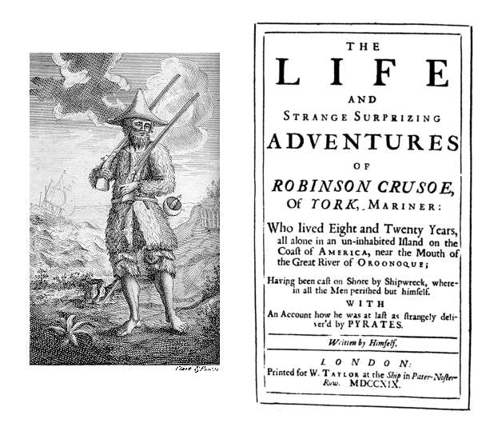

```{r setup, include=FALSE}
options(htmltools.dir.version = FALSE)
knitr::opts_chunk$set(echo=F,
                      message=F,
                      warning=F,
                      fig.retina = 3,
                      fig.align = "center")
library("tidyverse")
library("mosaic")
library("ggrepel")
library("fontawesome")
xaringanExtra::use_tile_view()
xaringanExtra::use_tachyons()

update_geom_defaults("label", list(family = "Fira Sans Condensed"))
update_geom_defaults("text", list(family = "Fira Sans Condensed"))

set.seed(256)
```

# Producer Behavior

.pull-left[

- How do **producers** decide:
    - which products to produce
    - in what quantity
    - using which resources
    - and for what price? 

- Answers to these questions are building blocks for **supply curves**	
]

.pull-right[

.center[

]
]

---

# The Basics of Production

.pull-left[

- Nearly all goods must be **produced** before we can exchange & consume them

- .hi[Consumption] is the **destruction** of value to gain utility
    - Consumption is the ultimate goal of all economic activity
]

.pull-right[

.center[

]
]

---

# The Basics of Production

.pull-left[

- .hi[Production] is the **creation** of value, by transforming *lower*-valued goods (resources, inputs, etc) into *higher*-valued goods (outputs, consumer products, etc)
]

.pull-right[

.center[

]
]

---

# The Firm

.pull-left[
- In modern market economies, most production takes place in a legal organization known as .hi[the firm]

- It does not *have* to be this way, and for most of history it was not this way!
    - Craft guilds
    - Independent artisans
    - Independent contractors

]

.pull-right[

.center[

]
]

---

# The Firm

.pull-left[
.smaller[
- Firms exist in the forms they do because they are an efficient response to particular problems of economic organization

- Lots of interesting, Nobel-prize winning, analysis on “theory of”

- For now, we'll sidestep these and just *assume* firms exist. Learn more in my .hi[Industrial Organization] course:
  - [Why Are There Firms?](https://ios20.classes.ryansafner.com/class/3.1-class/)
  - [The Firm as Nexus of Contracts](https://ios20.classes.ryansafner.com/class/3.2-class/)
  - [Asset Specificity and Vertical Integration](https://ios20.classes.ryansafner.com/class/3.3-class/)
  - [Contractual Restraints & Property Rights](https://ios20.classes.ryansafner.com/class/3.4-class/)

]
]

.pull-right[

.center[

]
]

---

# Production, Specialization, & Comparative Advantage

.pull-left[

- Consider a simple example — Robinson Crusoe stranded on a deserted island

- Anything he wants to consume, he must first produce
]

.pull-right[
.center[

]
]

---

# Production, Specialization, & Comparative Advantage

.pull-left[

- Suppose on this tropical island, there is the potential to farm two goods:
  - Bananas
  - Coconuts

]

.pull-right[
.center[

]
]

---

# Production, Specialization, & Comparative Advantage

.pull-left[

- There are two plots of land, with different fertility

|    | Max Bananas | Max Coconuts |
|----|------------:|-------------:|
| Plot A | 10 | 5 |
| Plot B | 45 | 15 |

]

.pull-right[
.center[

]
]

---

# Production, Specialization, & Comparative Advantage

.pull-left[

- There are two plots of land, with different fertility

|    | Max Bananas | Max Coconuts |
|----|------------:|-------------:|
| Plot A | 10 | 5 |
| Plot B | 45 | 15 |

- For each plot, the (opportunity) cost of producing a marginal unit:

|    | 1 Banana | 1 Coconut |
|----|---------:|----------:|
| Plot A | 0.5C | 2B |
| Plot B | 0.33C | 3B |

]

.pull-right[
.center[

]
]

---

# Production, Specialization, & Comparative Advantage

.pull-left[

- There are two plots of land, with different fertility

|    | Max Bananas | Max Coconuts |
|----|------------:|-------------:|
| Plot A | 10 | 5 |
| Plot B | 45 | 15 |

- For each plot, the (opportunity) cost of producing a marginal unit:

|    | 1 Banana | 1 Coconut |
|----|---------:|----------:|
| Plot A | 0.5C | 2B |
| Plot B | 0.33C | 3B |

]

.pull-right[

```{r ppf_jagged}
labels<-tribble(
  ~x, ~y, ~plot, ~lab,
  25, 15, "2", "slope = -1/3",
  50, 10, "1", "slope = -1/2"
)

ggplot(data=labels,
       x = x,
       y = y,
       color = plot)+
  geom_segment(x = 0, y = 20,
               xend = 45, yend = 15,
               size = 1, aes(color = "2"))+
  geom_segment(x = 45, y = 15,
               xend = 55, yend = 0,
               size = 1, aes(color = "1"))+
  ggrepel::geom_label_repel(data = labels,
                            aes(x = x, y = y, label = lab, color = plot),
                            seed = 2,
                            )+
  #scale_color_manual("Plot", values = c("A" = "green", "B" = "red"))+
  scale_color_viridis_d("Plot", begin = 0.25, end = 0.75, option = "d")+
  scale_x_continuous(breaks = seq(0,60,5),
                     limits = c(0,60),
                     expand=expand_scale(mult=c(0,0.1)))+
  scale_y_continuous(breaks = seq(0,60,5),
                     limits = c(0,60),
                     expand=expand_scale(mult=c(0,0.1)))+
  labs(x = "Bananas",
       y = "Coconuts")+
  theme_classic(base_family = "Fira Sans Condensed", base_size = 16)+
  #guides(color = guide_legend(override.aes = list(shape = 1)))
  theme(legend.position = "bottom")
```

]

---

# Production, Specialization, & Comparative Advantage

.pull-left[

- .hi[Production possibilities frontier (PPF)] displaying possible combinations of outputs
  - 

- Slope here called .hi[marginal rate of transformation (MRT)], we can just call it .hi[marginal cost]

- Increasing marginal cost

- Start with most productive plot first (B), then start cultivation on (A)
  - .hi-turquoise[“Intensive margin”]: producing more using first (most productive) plot
  - .hi-orange[“Extensive margin”]: bringing new plots into cultivation for production

]

.pull-right[

```{r, ref.label="ppf_jagged"}
```

]

---

# Production, Specialization, & Comparative Advantage

.pull-left[

- Imagine now there are *many* various plots of differing quality

- So a more-fully curved PPF

- Increasing marginal cost

]

.pull-right[

```{r}
home_point<-tribble(
  ~x, ~y, ~letter,
  2, 2.75, "A"
)

home_ppf_eq =function(x){sqrt(9-(x-0.75)^2)}
home_IC_1 = function(x){1.75+(2/x)}
home_price_1 = function(x){3.75-0.5*x}

home_ppf_1<-ggplot(data.frame(x=c(0,10)), aes(x=x))+
  stat_function(fun = home_ppf_eq, geom = "line", color = "blue", size = 1)+
  geom_label(x = 3.5, y = home_ppf_eq(3.5), label = "PPF", size = 3, color = "blue")+
  
  stat_function(fun = home_IC_1, geom = "line", color = "green", size = 1)+
  geom_label(x = 3.5, y = home_IC_1(3.5), label = "IC", size = 3, color = "green")+
  stat_function(fun = home_price_1, geom = "line", color = "purple", size = 1, linetype = "dashed")+
  geom_segment(x = 0, xend = 2, y = 2.75, yend = 2.75, linetype = "dotted", size = 1)+
  geom_segment(x = 2, xend = 2, y = 2.75, yend = 0, linetype = "dotted", size = 1)+
  geom_point(data = home_point,
             mapping=aes(x=x, y=y),
             size = 3)+
  geom_text_repel(data = home_point,
             mapping=aes(x=x, y=y,
             label = letter),
             seed = 4,
             size = 4)+
  scale_x_continuous(breaks=c(0,2),
                     labels=c(0, expression(x[1])),
                     limits=c(0,5),
                     expand=expand_scale(mult=c(0,0.1)))+
  scale_y_continuous(breaks=c(0,2.75),
                     labels=c(0, expression(y[1])),
                     limits=c(0,5),
                     expand=expand_scale(mult=c(0,0.1)))+
  theme_classic(base_family = "Fira Sans Condensed", base_size=20)
home_ppf_1
```
]

---

# Takeaways

.pull-left[

1. Trade is good
]

.pull-right[

]

---

class: inverse, center, middle

# What Do Firms Do?

---

# What Do Firms Do? I

.pull-left[

- We'll assume "the firm" is the agent to model:

- So what do firms do? 

- How would we set up an optimization model:

1. **Choose:** .hi-blue[ < some alternative >]

2. **In order to maximize:** .hi-green[< some objective >]

3. **Subject to:** .hi-red[< some constraints >]

]

.pull-right[

.center[

]
]

---

# What Do Firms Do? II

.pull-left[
.smaller[
- Firms convert some goods to other goods: 
]
]

.pull-right[
.center[

]
]

---

# What Do Firms Do? II

.pull-left[
.smaller[
- Firms convert some goods to other goods: 

- **Inputs**: $x_1, x_2, \cdots, x_n$
  - <span class="green">**Examples**: worker efforts, warehouse space, electricity, loans, oil, cardboard, fertilizer, computers, software programs, etc<span>
  ]
]

.pull-right[
.center[

]
]

---
# What Do Firms Do? II

.pull-left[
.smaller[
- Firms convert some goods to other goods: 

- **Inputs**: $x_1, x_2, \cdots, x_n$
  - <span class="green">**Examples**: worker efforts, warehouse space, electricity, loans, oil, cardboard, fertilizer, computers, software programs, etc<span>
  
- **Output**: $q$
  - <span class="green">**Examples**: gas, cars, legal services, mobile apps, vegetables, consulting advice, financial reports, etc<span>
]
]

.pull-right[
.center[

]
]

---

# What Do Firms Do? III

.pull-left[
- .hi[Technology] or a .hi[production function]: rate at which firm can convert specified inputs $(x_1, x_2, \cdots, x_n)$ into output $(q)$
$$q=f(x_1, x_2, \cdots, x_n)$$

]

.pull-right[
.center[

]
]

---

# Production Function as Recipe

.pull-left[
.center[The production function


]
]

.pull-right[
.center[The production algorithm


]

]

---

# Factors of Production I

$$q=A \,f(t,l,k)$$

.pull-left[
.smaller[
- Economists typically classify inputs, called the .hi[“factors of production” (FOP)]:

```{r,results="asis"}
tribble(
  ~"Factor", ~"Owned By", ~"Earns",
  "Land (t)", "Landowners", "Rent",
  "Labor (l)", "Laborers", "Wages",
  "Capital (k)", "Capitalists", "Interest",
) %>%
  knitr::kable(., format="html")
```
]
.smallest[
- $A$: .b["total factor productivity"] (ideas/knowledge/institutions)
- and Entrepreneurs/Owners who earn .b[Profit]

]
]
.pull-right[
.center[

]

]

---

# Factors of Production II

$$q=f(l,k)$$

.pull-left[

- We will assume just two inputs: labor $l$ and capital $k$

```{r,results="asis"}
tribble(
  ~"Factor", ~"Owned By", ~"Earns",
  "Labor (l)", "Laborers", "Wages",
  "Capital (k)", "Capitalists", "Interest"
) %>%
  knitr::kable(., format="html")
```

]

.pull-right[
.center[

]

]

---

# What Does a Firm Maximize?

.pull-left[

- We will assume firms .hi-purple[maximize profit `\\((\pi)\\)`]

- Not true for all firms
    - <span class="green">**Examples**: non-profits, charities, civic associations, government agencies, criminal organizations, etc</span>

- Even profit-seeking firms may also want to maximize additional things
    - <span class="green">**Examples**: goodwill, sustainability, social responsibility, etc </span>

]

.pull-right[

.center[

]
]

---

# Profits Have a Bad Rap These Days

.center[

]

---

# What is Profit?

.pull-left[

- In economics, profit is simply **benefits minus (opportunity) costs**

]

.pull-right[
.center[

]
]

---

# What is Profit?

.pull-left[

- In economics, profit is simply **benefits minus (opportunity) costs**

- Suppose firm sells **output** $q$ at price $p$

]

.pull-right[
.center[

]
]


---

# What is Profit?

.pull-left[

- In economics, profit is simply **benefits minus (opportunity) costs**

- Suppose firm sells **output** $q$ at price $p$

- It can buy each **input** $x_i$ at an associated price $p_i$
    - labor $l$ at wage rate $w$
    - capital $k$ at rental rate $r$

]

.pull-right[
.center[

]
]

---

# What is Profit?

.pull-left[

- In economics, profit is simply **benefits minus (opportunity) costs**

- Suppose firm sells **output** $q$ at price $p$

- It can buy each **input** $x_i$ at an associated price $p_i$
    - labor $l$ at wage rate $w$
    - capital $k$ at rental rate $r$

- The profit of selling $q$ units and using inputs $l,k$ is:

]

.pull-right[
.center[

]
]

---

# Who Gets the Profits? I

.pull-left[
$$\pi=\underbrace{pq}_{revenues}-\underbrace{(wl+rk)}_{costs}$$

]

.pull-right[
.center[

]
]

---

# Reminder from Macroeconomics: "The Circular Flow"

.center[

]

---

# Who Gets the Profits? I

.pull-left[
$$\pi=\underbrace{pq}_{revenues}-\underbrace{(wl+rk)}_{costs}$$

- .hi-purple[The firm's costs are all of the factor-owner's incomes!]
    - Landowners, laborers, creditors are all paid rent, wages, and interest, respectively

]

.pull-right[
.center[

]
]

---

# Who Gets the Profits? I

.pull-left[
$$\pi=\underbrace{pq}_{revenues}-\underbrace{(wl+rk)}_{costs}$$

- Profits are the .hi-purple[residual value] leftover after paying all factors

- Profits are income for the .hi[residual claimant(s)] of the production process (i.e. **owner(s)** of a firm):
    - Entrepreneurs
    - Shareholders

]

.pull-right[
.center[

]
]

---

# Who Gets the Profits? II

.pull-left[
$$\pi=\underbrace{pq}_{revenues}-\underbrace{(wl+rk)}_{costs}$$

- Residual claimants have incentives to maximize firm's profits, as this *maximizes their own income*

- Entrepreneurs and shareholders are the only participants in production that are *not* guaranteed an income!
    - Starting and owning a firm is inherently **risky**!

]

.pull-right[
.center[

]
]
---

# People Overestimate Profits

.center[

]

.source[Source: [American Enterprise Institute](https://www.aei.org/carpe-diem/the-public-thinks-the-average-company-makes-a-36-profit-margin-which-is-about-5x-too-high-part-ii/)]

---

# Corporations

.pull-left[

- .hi[Corporations] are firms that have many owners (.hi-purple[shareholders])
  - Each owns at least one .hi-purple[share of stock] or .hi-purple[equity] in the firm

- .hi-purple[Shareholders] are (partial) **owners** of the firm
  - .hi-purple[Residual claimants] on profits
  - Have decision-making rights
  - .hi-purple[Limited liability] of firm's debts

- Learn more in a business course!

]

.pull-right[

.center[

]
]

---

# Corporations

.pull-left[

- Many owners cannot possibly coordinate production: choose .hi[managers] to run day-to-day production in exchange for a salary

- One of the key differences in modern large firms is the **separation of ownership and control**
]

.pull-right[

.center[

]
]

---

# Agency Theory

.left-column[
.center[

.smallest[
Adam Smith

1723-1790
]
]
]

.right-column[

.smallest[
> "The trade of a joint stock company is always managed by a court of directors...The directors of such companies, however, .hi[being the managers rather of other people's money than of their own, it cannot well be expected that they should watch over it with the same anxious vigilance with which the partners in a private copartnery frequently watch over their own.] Like the stewards of a rich man, .hi[they are apt to consider attention to small matters as not for their master's honour], and very easily give themselves a dispensation from having it. Negligence and profusion, therefore, must always prevail, more or less, in the management of the affairs of such a company," (Book V, Chapter 1).

]
]

.source[Smith, Adam, 1776, [*An Enquiry into the Nature and Causes of the Wealth of Nations*](https://www.econlib.org/library/Smith/smWN.html)]

---

# A Peek Inside the Corporate Veil II

.pull-left[

- .hi[Principal-Agent problem]: owners and agents may have different incentives

- Maximizing different things!
    - Shareholders: maximize profit
    - Management: maximize own salary

- Again, learn more about corporate governance in [IO](https://ios20.classes.ryansafner.com/class/3.2-class/) & business courses
]

.pull-right[

.center[

]
]

---

# The Separation of Ownership and Control

.center[
<iframe width="560" height="315" src="https://www.youtube.com/embed/6Da1tDKFfno" frameborder="0" allow="accelerometer; autoplay; encrypted-media; gyroscope; picture-in-picture" allowfullscreen></iframe>
]

---

# Profits and Entrepreneurship: A Preview

.pull-left[

- In markets, production must face the .hi[profit test]:
    - <span class="hi-purple">Is consumer's willingness to pay $>$ opportunity cost of inputs?</span>

- Profits are an indication that **value is being created for society**

- Losses are an indication that **value is being destroyed for society**

- Survival in markets *requires* firms continually create value & earn profits
]

.pull-right[

.center[

]
]

---

# The Firm's Optimization Problem I

.pull-left[

- So what do firms do? 

1. **Choose:** .hi-blue[ < some alternative >]

2. **In order to maximize:** .hi-green[< profits >]

3. **Subject to:** .hi-red[< technology >]

- We've so far assumed they maximize profits and they are limited by their technology

]

.pull-right[

.center[

]
]

---

# The Firm's Optimization Problem II

.pull-left[
- What do firms **choose**? (Not an easy answer)

- Prices?
    - Depends on the market the firm is operating in!
    - Study of <span class="hi">industrial organization</span>
    
- Essential question: how competitive is a market? This will influence what firms (can) do
]

.pull-right[
.center[

]
]

---

# Industrial Organization: A Roadmap I

.pull-left[

- Begin with one extreme case: .hi["perfect competition"]
  - Firms can choose to sell as much $q^*$ as they want
  - Firms are constrained to sell at the (exogenous) market price $\bar{p}$

- Appropriate for settings with *many* firms, each small relative to market
]

.pull-right[

.center[

]
]
---

# Interlude

.pull-left[

- After we find firm's **optimal decisions** in this market (and have Exam 2), we will then finally look at **market equilibrium**

- Put Supply and Demand together
]

.pull-right[

```{r fig.retina=3}
library(mosaic)
update_geom_defaults("label", list(family = "Fira Sans Condensed"))

Demand=function(x){10-x}
Supply=function(x){x}

eq<-tribble(
  ~letter, ~x, ~y,
  "Eq.", 5, 5
)

CS<-tibble(x=c(0,0,5),
           y=c(5,10,5))

PS<-tibble(x=c(0,0,5),
           y=c(0,5,5))

p<-ggplot(data.frame(x=c(0,10)), aes(x=x))+
  stat_function(fun=Demand, geom="line", size=2, color = "blue")+
  stat_function(fun=Supply, geom="line", size=2, color = "red")+
  geom_label(aes(x=9,y=Demand(9)), color = "blue", label="Demand", size = 6)+
  geom_label(aes(x=9,y=Supply(9)), color = "red", label="Supply", size = 6)+
  geom_segment(aes(x=0, xend=5, y=5, yend=5),size=1, linetype="dotted")+
  geom_segment(aes(x=5, xend=5, y=5, yend=0),size=1, linetype="dotted")+
  geom_polygon(data=CS, aes(x=x,y=y), fill="blue", alpha=0.5)+ #CS
  geom_polygon(data=PS, aes(x=x,y=y), fill="red", alpha=0.5)+ #PS
  geom_label(aes(x=1.5, y= 3), label="PS", color="red", size =6)+
  geom_label(aes(x=1.5, y= 7), label="CS", color="blue", size =6)+
  geom_point(data = eq,
             mapping=aes(x=x, y=y),
             size = 4)+
  geom_text_repel(data = eq,
             mapping=aes(x=x, y=y,
             label = letter),
             size = 6)+
    scale_x_continuous(breaks=seq(0,10,1),
                     limits=c(0,10),
                     expand=expand_scale(mult=c(0,0.1)))+
  scale_y_continuous(breaks=seq(0,10,1),
                     limits=c(0,10),
                     expand=expand_scale(mult=c(0,0.1)))+
  guides(fill=F)+
  labs(x = "Quantity",
       y = "Price")+
  theme_classic(base_family = "Fira Sans Condensed", base_size=20)
p

```

]

---

# Interlude

.pull-left[

- We've seen how **consumers** cause and respond to market changes
  - e.g. $(\Delta p_x$, $\Delta p_y$, $\Delta m$)
  
- We're about to explore how **producers** cause and respond to market changes

- Finally we can explain all of these market changes with Supply and Demand .hi[equilibrium models]

- Discuss how markets work, why they are good & efficient, and when they fail
]

.pull-right[

```{r fig.retina=3}
p
```

]

---

# Industrial Organization: A Roadmap II

.pull-left[
- Examine another extreme case: .hi[monopoly] of a single seller
    - Appropriate for some markets

- .hi-purple["Imperfect competition"]: models of .hi[monopolistic competition] & .hi[oligopoly]
    - In latter case, firms act **strategically**, so we will need <span class="hi-purple">game theory</span>
    
- Firms can choose *both* $q^*$ & $p^*$ to maximize $\pi$

]

.pull-right[

.center[

]
]