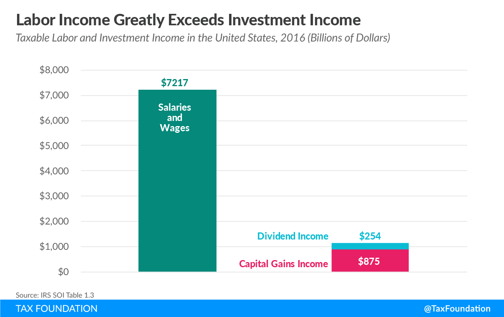
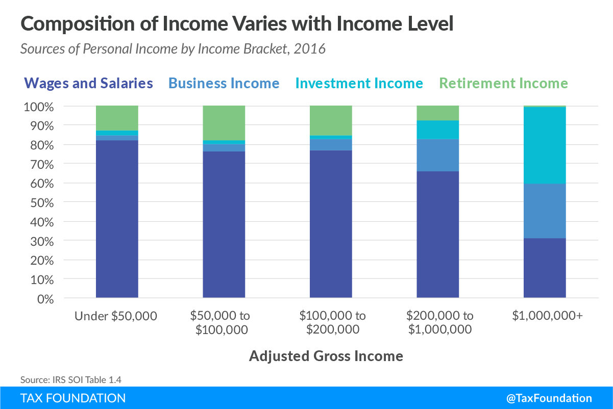

```{r setup, include=FALSE}
options(htmltools.dir.version = FALSE)
knitr::opts_chunk$set(echo=F,
                      message=F,
                      warning=F,
                      fig.retina = 3,
                      fig.align = "center")
library("tidyverse")
library("mosaic")
library("ggrepel")
library("fontawesome")
xaringanExtra::use_tile_view()
xaringanExtra::use_tachyons()
xaringanExtra::use_freezeframe()

update_geom_defaults("label", list(family = "Fira Sans Condensed"))
update_geom_defaults("text", list(family = "Fira Sans Condensed"))

set.seed(256)
```

class: inverse

# Outline

### [Labor Supply Decisions](#12)

### [Labor Market for Competitive Firm](#26)

### [Labor Market for a Monopoly](#41)

### [Monopsony Power](#45)

### [Monopoly Power in Labor Markets: Unions](#65)

---

# Returning to Firms

.pull-left[
- Recall a firm uses technology that buys inputs, transforms them, and sells output
$$q=f(k,l)$$
  - We classified inputs into the .hi[factors of production]: land, labor, capital

- We *assumed* fixed factor prices
  - show up in total cost $=wL+rK$

- Where do they come from? .hi[Factor markets]
]

.pull-right[
.center[

]
]

---

# Circular Flow

.center[

]

---

# Firms’ Payments to Factors are Income To Households

.quitesmall[
```{r}
income <- tribble(
  ~"Income Type", ~"2016 Amount (Bns)",
  "Salaries and wages", 7217,
  "Taxable pensions and annuities", 694,
  "Capital gains less losses", 621,
  "Partnership and S corporation net income", 629,
  "Business net income", 389,
  "Taxable Social Security benefits", 286,
  "Taxable IRA distributions", 258,
  "Ordinary dividends", 254,
  "Total rental and royalty net income", 98,
  "Taxable interest", 97
)
income %>% mutate(Percent = paste0(round(100*`2016 Amount (Bns)`/sum(`2016 Amount (Bns)`),2),"%"),
                  `Amount (2016)` = paste0("$",`2016 Amount (Bns)`, " Bn")) %>%
  select(`Income Type`, `Amount (2016)`, `Percent`) %>%
  arrange(desc(`Percent`)) %>%
  knitr::kable(., format = "html", align = "lrr")
```
]

.source[Source: [Tax Foundation, 2018](https://taxfoundation.org/sources-of-personal-income-2016/)]

---

# Firms’ Payments to Factors are Income To Households

.pull-left[
.center[

]
]

.pull-right[
.center[

]
]

.source[Source: [Tax Foundation, 2018](https://taxfoundation.org/sources-of-personal-income-2016/)]

---

# Supply and Demand in Factor Markets

.pull-left[

- The price of a factor is governed by the same market forces as output:

- .hi-red[Supply of Factor]: willingness of factor owners to accept and sell/rent their services to firms
  - landowners, workers, capitalists, resource owners, suppliers

- .hi-blue[Demand for Factor]: willingness of firms to pay for/hire factor services
]

.pull-right[
```{r, fig.retina=3}
demand<-function(x){10-x}
supply<-function(x){x}
ggplot(data.frame(x=c(0,10)), aes(x=x))+
  stat_function(fun=demand, geom="line", size=2, color = "blue")+
    geom_label(aes(x=9,y=demand(9)), color = "blue", label="Demand = Max WTP", size = 5)+
  stat_function(fun=supply, geom="line", size=2, color = "red")+
    geom_label(aes(x=9,y=supply(9)), color = "red", label="Supply = Min WTA", size = 5)+
  geom_segment(x=5, xend=5, y=0, yend=5, size=1, linetype="dotted")+
  geom_segment(x=0, xend=5, y=5, yend=5, size=1, linetype="dotted")+
    scale_x_continuous(breaks=c(0,5),
                       labels=c(0,expression(x)),
                     expand=expand_scale(mult=c(0,0.1)))+
  scale_y_continuous(breaks=c(0,5),
                     labels=c(0,expression(p[x])),
                     limits=c(0,10),
                     expand=expand_scale(mult=c(0,0.1)))+
  guides(fill=F)+
  labs(title = "Factor Market",
       x = "Quantity of Factor (x)",
       y = expression(paste("Price of Factor, ", p[x])))+
  theme_classic(base_family = "Fira Sans Condensed", base_size=20)
```
]

---

# Factor Market Prices and Opportunity Costs

.pull-left[

- .hi[Factor price represents **opportunity cost** of hiring a factor for an alternative use]
  - Firms not only pay for direct use of a factor, but also indirectly for *not using* it in an alternate process!


]

.pull-right[
.center[

]
]
---

# Factor Market Prices and Opportunity Costs

.pull-left[

- .green[**Example**]: a producer of hammers buys steel, pays (the opportunity cost) for "taking" the steel away from alternative uses

]

.pull-right[
.center[

]
]

---

# Factor Market Prices and Opportunity Costs

.pull-left[

- .green[**Example**]: e.g. salary for a skilled worker must be high enough to keep them at their current firm, and not be attracted to other firms/industries

]

.pull-right[
.center[

]
]

---

# Example Factor Market: Labor Markets

.pull-left[
- Empirically, about 70% of total cost of production comes from labor

- We’ll focus just on the .hi[market for labor] as an example factor market

- Can do the same for *any* factor market 
  - (e.g. capital, land, materials, etc.)

- Next class, we’ll focus on the particularities of .hi-purple[capital markets]
]

.pull-right[
.center[

]
]

---

class: inverse, center, middle

# Labor Supply Decisions

---

# Labor Supply Decisions

.pull-left[

- The .red[Supply of Labor] comes from **individual decisions to work**

- Labor is considered a .hi[disutility] (a .hi[bad])
  - **Opportunity cost** of labor is .hi[leisure]
  - But, labor generates .hi-purple[income] for .hi-purple[consumption] (a good)

- Tradeoff: if you work more, you get more income, but less leisure
]

.pull-right[
.center[


]
]

---

# Modeling Labor Supply Decisions

.pull-left[
.smallest[
- Easiest to apply our consumer choice model between two goods:
$$u(C,\ell)$$
  - $C$: consumption
  - $\ell$: hours of leisure

- Define amount of hours worked:
$$H = 24-\ell$$

- .red[Budget constraint]: market price of leisure: $-w$
  - set price of $c$ to $1, a “numeraire” good
  - slope = $-\frac{w}{1}$, i.e. $-w$

]
]

.pull-right[
```{r}
bc<-function(x){24-x}
ic<-function(x){144/x}
points<-tribble(
  ~x, ~y, ~letter,
  12, 12, "A"
)
opt<-ggplot(data = tibble(x = c(0,10)), aes(x = x))+
  geom_segment(x = 12, xend = 12, y = 0, yend = 12, linetype = "dashed", size = 1)+
  geom_segment(x = 0, xend = 12, y = 12, yend = 12, linetype = "dashed", size = 1)+
  geom_function(fun = bc, geom = "line", size = 2, color = "red")+
  geom_label(x = 2, y = bc(2), color = "red", label = "BC")+
  geom_function(fun = ic, geom = "line", size = 2, color = "blue")+
  geom_label(x = 22, y = ic(22), color = "blue", label = expression(u[1]))+
  geom_point(data = subset(points, letter %in% c("A")), aes(x = x, y = y), size = 5)+
  scale_x_continuous(breaks = c(0,12, 24),
                     labels = c(0, expression("\u2113"^"*"), 24),
                     limits = c(0,25),
                     expand = c(0,0))+
  scale_y_continuous(breaks = c(0,12,24),
                     labels = c(0,expression(c^"*"),"24w"),
                     expand = c(0,0),
                     limits = c(0,50))+
  labs(x = "Leisure (Hours)",
       y = "Consumption ($)",
       caption = expression(paste("Labor Hours Worked ", H == 24, " — \u2113")))+
  theme_classic(base_family = "Fira Sans Condensed", base_size = 16)
opt
```
]

---

# Modeling Labor Supply Decisions

.pull-left[
- Person will .hi-purple[optimally choose] to supply $H^\star = 24 - \ell^\star$ hours

- Enjoy $\ell^\star$ leisure and consume $c^\star$ goods from labor income $wH^\star$

]

.pull-right[
```{r}
opt
```
]

---

# Modeling Labor Supply Decisions: A Change In Wages

.pull-left[
.smaller[
- What will happen to the optimal labor supply decision if wage $w$ increases?

- It depends!

- Leisure is a normal good, but this makes labor “inferior”
$$H = 24 -\ell$$
  - $\uparrow \ell \implies \downarrow H$

- This is why .hi-purple[income and substitution effects] are important! (remember [all that stuff](/content/1.6-content)? 😰)
]
]

.pull-right[
.center[

]
]

---

# Modeling Labor Supply Decisions: A Change In Wages

.pull-left[

- .purple[(Overall) Price effect]: $A \rightarrow C$
  - Higher wage $w$ leads to less leisure $\ell$ and therefore, more hours worked $H$

- Upward sloping .red[labor supply curve]
]

.pull-right[
```{r}
bc2<-function(x){48-2*x}
ic<-function(x){144/x}
points<-tribble(
  ~x, ~y, ~letter,
  12, 12, "A",
  8, 18, "B",
  10, 28, "C"
)
ic2<-function(x){400/(x+4)}
bc_sub<-function(x){34-2*x}
ggplot(data = tibble(x = c(0,10)), aes(x = x))+
  geom_segment(x = 10, xend = 10, y = 0, yend = 28, linetype = "dashed", size = 0.5)+
  geom_segment(x = 0, xend = 10, y = 28, yend = 28, linetype = "dashed", size = 0.5)+
  
  geom_segment(x = 12, xend = 12, y = 0, yend = 12, linetype = "dashed", size = 0.5)+
  geom_segment(x = 0, xend = 12, y = 12, yend = 12, linetype = "dashed", size = 0.5)+
  geom_function(fun = bc, geom = "line", size = 2, color = "red")+
  geom_label(x = 2, y = bc(2), color = "red", label = expression(BC[1]))+
  geom_function(fun = ic, geom = "line", size = 2, color = "blue")+
  geom_label(x = 22, y = ic(22), color = "blue", label = expression(u[1]))+
  
  geom_function(fun = bc2, geom = "line", size = 2, color = "darkred")+
  geom_label(x = 2, y = bc2(2), color = "darkred", label = expression(BC[2]))+
  
  # geom_function(fun = bc_sub, geom = "line", size = 2, color = "orange", linetype = "dashed")+
  
    geom_function(fun = ic2, geom = "line", size = 2, color = "green")+
  geom_label(x = 22, y = ic2(22), color = "green", label = expression(u[2]))+
  geom_point(data = subset(points, letter %in% c("A", "C")), aes(x = x, y = y), size = 5)+
  ggrepel::geom_text_repel(data = subset(points, letter %in% c("A", "C")), aes(x = x, y = y, label = letter), size = 4, seed = 4, box.padding = 0.5)+
  annotate("segment", x = 12, xend = 10, y = 2, yend = 2, colour = "purple", size=2, alpha=1, arrow=arrow(length=unit(0.5,"cm"), ends="last", type="closed"))+
  scale_x_continuous(breaks = c(0,10, 12, 24),
                     labels = c(0, expression("\u2113"[2]), expression("\u2113"[1]), 24),
                     limits = c(0,25),
                     expand = c(0,0))+
  scale_y_continuous(breaks = c(0,12,24,28,48),
                     labels = c(0,expression(c[1]),expression(24*w[1]),expression(c[2]), expression(24*w[2])),
                     expand = c(0,0),
                     limits = c(0,50))+
  labs(x = "Leisure (Hours)",
       y = "Consumption ($)",
       #title = "Individual Labor Supply Decision: Increase in Wage",
       #subtitle = "(Substitution Effect Dominates)",
       caption = expression(paste("Labor Hours Worked ", H == 24,  " — \u2113")))+
  theme_classic(base_family = "Fira Sans Condensed", base_size = 16)
```
]

---

# Modeling Labor Supply Decisions: A Change In Wages

.pull-left[

- .orange[Substitution effect]: as wage $w$ increases, the price of leisure $\ell$ is increasing, so consume less leisure (normal good)
  - Thus, work more hours

- Graphically: under higher wage $BC_2$, substitute more $c$ for less $\ell$ (more labor) holding utility constant
  - $A \rightarrow B$: more $c$, less $\ell$ (more $H)$
]

.pull-right[
```{r}
bc_sub<-function(x){34-2*x}
se_dom<-ggplot(data = tibble(x = c(0,10)), aes(x = x))+
  geom_function(fun = bc, geom = "line", size = 2, color = "red")+
  geom_label(x = 2, y = bc(2), color = "red", label = expression(BC[1]))+
  geom_function(fun = ic, geom = "line", size = 2, color = "blue")+
  geom_label(x = 22, y = ic(22), color = "blue", label = expression(u[1]))+
  
  geom_function(fun = bc2, geom = "line", size = 2, color = "darkred")+
  geom_label(x = 2, y = bc2(2), color = "darkred", label = expression(BC[2]))+
  
  
  geom_function(fun = bc_sub, geom = "line", size = 2, color = "orange", linetype = "dashed")+
  
  geom_function(fun = ic2, geom = "line", size = 2, color = "green")+
  geom_label(x = 22, y = ic2(22), color = "green", label = expression(u[2]))+
  geom_segment(x = 10, xend = 10, y = 0, yend = 28, linetype = "dashed", size = 0.5)+
  geom_segment(x = 0, xend = 10, y = 28, yend = 28, linetype = "dashed", size = 0.5)+
  
  geom_segment(x = 12, xend = 12, y = 0, yend = 12, linetype = "dashed", size = 0.5)+
  geom_segment(x = 0, xend = 12, y = 12, yend = 12, linetype = "dashed", size = 0.5)+
  
  geom_segment(x = 8, xend = 8, y = 0, yend = 18, linetype = "dashed", size = 0.5)+
  geom_segment(x = 0, xend = 8, y = 18, yend = 18, linetype = "dashed", size = 0.5)+
  geom_point(data = subset(points, letter %in% c("A", "B", "C")), aes(x = x, y = y), size = 5)+
  ggrepel::geom_text_repel(data = subset(points, letter %in% c("A","B", "C")), aes(x = x, y = y, label = letter), size = 4, seed = 4, box.padding = 0.5)+
  #annotate("segment", x = 12, xend = 10, y = 2, yend = 2, colour = "purple", size=2, alpha=1, arrow=arrow(length=unit(0.5,"cm"), ends="last", type="closed"))+
  annotate("segment", x = 12, xend = 8, y = 5, yend = 5, colour = "orange", size=2, alpha=1, arrow=arrow(length=unit(0.5,"cm"), ends="last", type="closed"))+
  scale_x_continuous(breaks = c(0,8,10,12, 24),
                     labels = c(0, expression("\u2113"[s]), expression("\u2113"[2]), expression("\u2113"[1]), 24),
                     limits = c(0,25),
                     expand = c(0,0))+
  scale_y_continuous(breaks = c(0,12,18,24,28,48),
                     labels = c(0,expression(c[1]),expression(c[s]),expression(24*w[1]),expression(c[2]), expression(24*w[2])),
                     expand = c(0,0),
                     limits = c(0,50))+
  labs(x = "Leisure (Hours)",
       y = "Consumption ($)",
       #title = "Individual Labor Supply Decision: Increase in Wage",
       #subtitle = "(Substitution Effect Dominates)",
       caption = expression(paste("Labor Hours Worked ", H == 24,  " — \u2113")))+
  theme_classic(base_family = "Fira Sans Condensed", base_size = 16)
se_dom
```
]

---

# Modeling Labor Supply Decisions: A Change In Wages

.pull-left[

- .green[Real income effect]: the higher wage makes you wealthier in real terms, so buy more of everything (including $\ell$, meaning **work _fewer_ hours!**)
  - $B \rightarrow C$: attain higher indifference curve $\color{green}{u_2}$ 
  - “Inferior” good: higher wages induce *more* leisure (and fewer labor hours)
]

.pull-right[
```{r}
se_dom+
  annotate("segment", x = 8, xend = 10, y = 8, yend = 8, colour = "green", size=2, alpha=1, arrow=arrow(length=unit(0.5,"cm"), ends="last", type="closed"))
```
]

---

# Modeling Labor Supply Decisions: A Change In Wages

.pull-left[

- Income & substitution effects cut against each other

- If .orange[Substitution effect] $>$ .green[Income effect], then we get a positive .purple[price effect]:
  - **Increase in wages** causes .hi-purple[more work] (less leisure)

- Matches our intuition, .red[upward-sloping labor supply curve]
]

.pull-right[
```{r}
se_dom+
  annotate("segment", x = 8, xend = 10, y = 8, yend = 8, colour = "green", size=2, alpha=1, arrow=arrow(length=unit(0.5,"cm"), ends="last", type="closed"))+
  annotate("segment", x = 12, xend = 10, y = 2, yend = 2, colour = "purple", size=2, alpha=1, arrow=arrow(length=unit(0.5,"cm"), ends="last", type="closed"))+
  labs(x = "Leisure (Hours)",
       y = "Consumption ($)",
       title = "Individual Labor Supply Decision: Increase in Wage",
       subtitle = "(Substitution Effect Dominates)",
       caption = expression(paste("Labor Hours Worked ", H == 24,  " — \u2113")))
```
]

---

# Modeling Labor Supply Decisions: A Change In Wages

.pull-left[

- If .green[Income effect] > .orange[Substitution effect], leading to a negative .purple[price effect]:
  - **Increase in wages** causes .hi-purple[less work] (more leisure)
  - “Giffen-style” scenario, but **very plausible** for labor! (unlike consumer goods)

- Intuition: imagine having an income target for a big purchase, and your salary increases
]

.pull-right[
```{r}
points2<-tribble(
  ~x, ~y, ~letter,
  12, 12, "A",
  8, 18, "B",
  14.5, 19, "C"
)
ic3<-function(x){300/(x-2)-4.5}
ggplot(data = tibble(x = c(0,10)), aes(x = x))+
  geom_function(fun = bc, geom = "line", size = 2, color = "red")+
  geom_label(x = 2, y = bc(2), color = "red", label = expression(BC[1]))+
  geom_function(fun = ic, geom = "line", size = 2, color = "blue")+
  geom_label(x = 22, y = ic(22), color = "blue", label = expression(u[1]))+
  
  geom_function(fun = bc2, geom = "line", size = 2, color = "darkred")+
  geom_label(x = 2, y = bc2(2), color = "darkred", label = expression(BC[2]))+
  
  geom_function(fun = bc_sub, geom = "line", size = 2, color = "orange", linetype = "dashed")+
  
    geom_function(fun = ic3, geom = "line", size = 2, color = "green")+
  geom_label(x = 22, y = ic3(22), color = "green", label = expression(u[2]))+
  geom_segment(x = 12, xend = 12, y = 0, yend = 12, linetype = "dashed", size = 0.5)+
  geom_segment(x = 0, xend = 12, y = 12, yend = 12, linetype = "dashed", size = 0.5)+
  
  geom_segment(x = 8, xend = 8, y = 0, yend = 18, linetype = "dashed", size = 0.5)+
  geom_segment(x = 0, xend = 8, y = 18, yend = 18, linetype = "dashed", size = 0.5)+
  geom_segment(x = 14.5, xend = 14.5, y = 0, yend = 19, linetype = "dashed", size = 0.5)+
  geom_segment(x = 0, xend = 14.5, y = 19, yend = 19, linetype = "dashed", size = 0.5)+
  geom_point(data = subset(points2, letter %in% c("A", "B", "C")), aes(x = x, y = y), size = 5)+
  ggrepel::geom_text_repel(data = subset(points2, letter %in% c("A","B", "C")), aes(x = x, y = y, label = letter), size = 4, seed = 4, box.padding = 0.5)+
  
  annotate("segment", x = 12, xend = 8, y = 5, yend = 5, colour = "orange", size=2, alpha=1, arrow=arrow(length=unit(0.5,"cm"), ends="last", type="closed"))+
  
  annotate("segment", x = 8, xend = 14.5, y = 8, yend = 8, colour = "green", size=2, alpha=1, arrow=arrow(length=unit(0.5,"cm"), ends="last", type="closed"))+
  annotate("segment", x = 12, xend = 14.5, y = 2, yend = 2, colour = "purple", size=2, alpha=1, arrow=arrow(length=unit(0.5,"cm"), ends="last", type="closed"))+
  scale_x_continuous(breaks = c(0, 8, 12, 14.5, 24),
                     labels = c(0, expression("\u2113"[s]), expression("\u2113"[1]), expression("\u2113"[2]), 24),
                     limits = c(0,25),
                     expand = c(0,0))+
  scale_y_continuous(breaks = c(0,12,18, 19, 24,48),
                     labels = c(0,expression(c[s]),expression(c[1]),expression(c[2]), expression(24*w[1]), expression(24*w[2])),
                     expand = c(0,0),
                     limits = c(0,50))+
  labs(x = "Leisure (Hours)",
       y = "Consumption ($)",
       title = "Individual Labor Supply Decision: Increase in Wage",
       subtitle = "(Income Effect Dominates)",
       caption = expression(paste("Labor Hours Worked ", H == 24, " — \u2113")))+
  theme_classic(base_family = "Fira Sans Condensed", base_size = 16)
```
]

---

# Modeling Labor Supply Decisions: A Change In Wages

.pull-left[

- We often see “backward-bending” labor supply curves

- Depends on whether income or substitution effect dominates
]
.pull-right[
```{r}
engel<-tribble(
  ~Income, ~`Bus Rides`,
  0, 0,
  10, 3,
  15, 5,
  20, 6,
  25, 7,
  30, 5,
  35, 3,
  40, 2,
  45, 0
)
ggplot(data = engel, aes(x=`Bus Rides`,
                         y=Income))+
  geom_point(color="red")+
  geom_path(color="red", size=2)+
  geom_label(x = 6, y = 20, label = "Labor Supply", color = "red", size =5)+
  geom_hline(yintercept=25, linetype = "dashed", size = 1)+
  geom_text(x=8, y=30, label="SE < IE", size = 5)+
  geom_text(x=8, y=20, label="SE > IE", size = 5)+
  scale_y_continuous(breaks=seq(0,50,5),
                     limits=c(0,50),
                     labels=scales::dollar,
                     expand=expand_scale(mult=c(0,0.1)))+
  scale_x_continuous(breaks=seq(0,10,1),
                     limits=c(0,10),
                     expand=expand_scale(mult=c(0,0.1)))+
  labs(x = "Hours Worked (Labor)",
       y = "Wage")+
  theme_classic(base_family = "Fira Sans Condensed", base_size=14)
```

]

---

# A Brief Digression on Economic Rents I

.pull-left[

- Recall .hi-red[market supply] is the **minimum willingness to accept**, the minimum price necessary to bring a resource to market (its opportunity cost)

- But all (equivalent) labor is paid the *market wage*, $w^*$ determined by market labor supply and labor demand

]

.pull-right[

```{r, fig.retina=3}
rent<-tribble(
  ~x, ~y,
  0, 0,
  5, 5,
  0, 5
)
# make plot 
ggplot(data.frame(x=c(0,10)), aes(x=x))+
  geom_polygon(data=rent, aes(x=x,y=y, fill="red"), alpha=0.5)+ #CS
  stat_function(fun=demand, geom="line", size=2, color = "blue")+
    geom_label(aes(x=9,y=demand(9)), color = "blue", label="Demand", size = 5)+
  stat_function(fun=supply, geom="line", size=2, color = "red")+
    geom_label(aes(x=9,y=supply(9)), color = "red", label="Supply", size = 5)+
  geom_segment(x=5, xend=5, y=0, yend=5, size=1, linetype="dotted")+
  geom_segment(x=0, xend=5, y=5, yend=5, size=1, linetype="dotted")+
    scale_x_continuous(breaks=c(0,5),
                       labels=c(0,"L*"),
                     expand=expand_scale(mult=c(0,0.1)))+
  scale_y_continuous(breaks=c(0,5),
                     labels=c(0,"w*"),
                     limits=c(0,10),
                     expand=expand_scale(mult=c(0,0.1)))+
  guides(fill=F)+
  labs(title = "Labor Market",
       x = "Quantity of Labor (L)",
       y = "Price of Labor, (w)")+
  theme_classic(base_family = "Fira Sans Condensed", base_size=20)
```
]

---

# A Brief Digression on Economic Rents II

.pull-left[

- Some workers would have accepted a job for less than $w^*$

- These inframarginal workers earn .hi[economic rent] in excess of what is needed to bring them into the market (their opportunity cost)

]

.pull-right[

```{r, fig.retina=3}
rent<-tribble(
  ~x, ~y,
  0, 0,
  5, 5,
  0, 5
)
# make plot 
ggplot(data.frame(x=c(0,10)), aes(x=x))+
  geom_polygon(data=rent, aes(x=x,y=y, fill="red"), alpha=0.5)+ #CS
  stat_function(fun=demand, geom="line", size=2, color = "blue")+
    geom_label(aes(x=9,y=demand(9)), color = "blue", label="Demand", size = 5)+
  stat_function(fun=supply, geom="line", size=2, color = "red")+
    geom_label(aes(x=9,y=supply(9)), color = "red", label="Supply", size = 5)+
  geom_segment(x=5, xend=5, y=0, yend=5, size=1, linetype="dotted")+
  geom_segment(x=0, xend=5, y=5, yend=5, size=1, linetype="dotted")+
    scale_x_continuous(breaks=c(0,5),
                       labels=c(0,"L*"),
                     expand=expand_scale(mult=c(0,0.1)))+
  scale_y_continuous(breaks=c(0,5),
                     labels=c(0,"w*"),
                     limits=c(0,10),
                     expand=expand_scale(mult=c(0,0.1)))+
  guides(fill=F)+
  labs(title = "Labor Market",
       x = "Quantity of Labor (L)",
       y = "Price of Labor, (w)")+
  theme_classic(base_family = "Fira Sans Condensed", base_size=20)
```
]

---

# A Brief Digression on Economic Rents III

.pull-left[

- Consider a factor (such as land) for which the supply is perfectly inelastic (e.g. a fixed supply)

- Then the **entire value of the land is economic rent**!

- .hi-purple[The *less* elastic the supply of a factor, the *more* economic rent it generates!]

]

.pull-right[

```{r, fig.retina=3}
# make plot 
ggplot(data.frame(x=c(0,10)), aes(x=x))+
  geom_rect(xmin=0,xmax=5,ymin=0,ymax=5, fill="red", alpha=0.3)+ #CS
  stat_function(fun=demand, geom="line", size=2, color = "blue")+
    geom_label(aes(x=9,y=demand(9)), color = "blue", label="Demand", size = 5)+
  geom_vline(xintercept=5, size=2, color = "red")+
    geom_label(aes(x=5,y=10), color = "red", label="Supply", size = 5)+
  geom_segment(x=5, xend=5, y=0, yend=5, size=1, linetype="dotted")+
  geom_segment(x=0, xend=5, y=5, yend=5, size=1, linetype="dotted")+
    scale_x_continuous(breaks=c(0,5),
                       labels=c(0,"T*"),
                     expand=expand_scale(mult=c(0,0.1)))+
  scale_y_continuous(breaks=c(0,5),
                     labels=c(0,"r*"),
                     limits=c(0,10),
                     expand=expand_scale(mult=c(0,0.1)))+
  guides(fill=F)+
  labs(title = "Land Market",
       x = "Quantity of Land (T)",
       y = "Price of Land, (r)")+
  theme_classic(base_family = "Fira Sans Condensed", base_size=20)
```
]

---

class: inverse, center, middle

# Labor Market for a Competitive Firm

---


# Derived Demand in Factor Markets

.pull-left[
- Demand for factors is a .hi-purple[“derived demand”]:
  - Firm only demands inputs to the extent they **contribute to producing sellable output**

- Firm faces a .hi-purple[tradeoff] when **hiring more labor**, as more labor $\Delta L$ creates:
  1. .hi[Marginal Benefit]: Increases output and thus revenue
  2. .hi[Marginal Cost]: Increases costs
]

.pull-right[
.center[

]
]

---

# Marginal Revenue Product (of Labor)

- Hiring more labor increases new output (i.e. labor's .hi-purple[`\\(MP_L\\)`])
  - [Recall](/content/2.2-content/): $MP_L=\frac{\Delta q}{\Delta L}$, where $q$ is units of output

--

- Additional output generates new revenues (i.e. labor's .hi-purple[`\\(MR(q)\\)`])
  - Recall: $MR(q)=\frac{\Delta R(q)}{\Delta q}$, where $R(q)$ is total revenue
--

- Hiring more labor, on the **margin**, generates a **benefit**, called the .hi[marginal revenue product of labor, `\\(MRP_L\\)`]:
$$MRP_L=MP_L* MR(q)$$
  - i.e. the number of new products a new worker makes times the revenue earned by selling the new products


---

# Marginal Revenue Product for *Competitive* Firms

.pull-left[

- This is the .hi-blue[Firm's Demand for Labor]:

$$MRP_L=MP_L* MR(q)$$

- For a firm in a .hi[competitive (output) market], firm's $MR(q)=p$, hence:

$$MRP_L=MP_L*p$$
where $p$ is the price of the firm's *output*

]

```{r, fig.retina=3}
#library("mosaic")
Demand=function(x){10-2*x}
MC=function(x){2}
# make plot 
ggplot(data.frame(x=c(0,10)), aes(x=x))+
  
  # curves 
  stat_function(fun=Demand, geom="line", size=2, color="blue")+
  # surpluses
  #geom_polygon(data=CS, aes(x=x,y=y, fill="Consumer"), alpha=0.5)+ #CS
  # labels 
  #geom_text(aes(x=q_PC,y=w,label="N.E.",family = "Yanone Kaffeesatz Regular"),hjust=-0.1, vjust=-0.25, color="black")+
  annotate(geom = "label", x = 2, y = Demand(2), label = expression("Demand"==MRP[L]),
           color = "blue", size = 6) +
  scale_x_continuous(breaks = c(0),
                     labels = c(0),
                     expand=c(0,0))+
  scale_y_continuous(breaks = c(0,10),
                     labels = c(0,expression(choke)),
                     limits = c(0,10),
                     expand=c(0,0))+
  theme_classic(base_family = "Fira Sans Condensed", base_size=20)+
  labs(x = "Quantity of Labor (L)",
       y = "Price of Labor (w)")
```

---

# Marginal Revenue Product for *Competitive* Firms

.pull-left[

$$MRP_L=MP_L* p$$

- Marginal benefit of hiring labor, $MRP_L$ **falls** with more labor used
    - production exhibits **diminishing marginal returns to labor**!

- .hi[Choke price for labor demand]: price too high for firm to purchase any labor

]

```{r, fig.retina=3}
#library("mosaic")
Demand=function(x){10-2*x}
MC=function(x){2}
# make plot 
ggplot(data.frame(x=c(0,10)), aes(x=x))+
  
  # curves 
  stat_function(fun=Demand, geom="line", size=2, color="blue")+
  # surpluses
  #geom_polygon(data=CS, aes(x=x,y=y, fill="Consumer"), alpha=0.5)+ #CS
  # labels 
  #geom_text(aes(x=q_PC,y=w,label="N.E.",family = "Yanone Kaffeesatz Regular"),hjust=-0.1, vjust=-0.25, color="black")+
  annotate(geom = "label", x = 2, y = Demand(2), label = expression("Demand"==MRP[L]),
           color = "blue", size = 6) +
  scale_x_continuous(breaks = c(0),
                     labels = c(0),
                     expand=c(0,0))+
  scale_y_continuous(breaks = c(0,10),
                     labels = c(0,expression(choke)),
                     limits = c(0,10),
                     expand=c(0,0))+
  theme_classic(base_family = "Fira Sans Condensed", base_size=20)+
  labs(x = "Quantity of Labor (L)",
       y = "Price of Labor (w)")
```

---

# A Competitive *Factor* Market

.pull-left[
```{r, fig.retina=3, fig.height=5}
demand<-function(x){10-x}
supply<-function(x){x}
supply_firm<-function(x){5}
ggplot(data.frame(x=c(0,10)), aes(x=x))+
  stat_function(fun=supply_firm, geom="line", size=2, color = "red")+
    geom_label(aes(x=9,y=supply_firm(9)), color = "red", label="Supply", size = 5)+
    scale_x_continuous(breaks=c(0),
                       labels=c(0),
                     limits=c(0,10),
                     expand=expand_scale(mult=c(0,0.1)))+
  scale_y_continuous(breaks=c(0,5),
                     labels=c(0,"w*"),
                     limits=c(0,10),                   
                     expand=expand_scale(mult=c(0,0.1)))+
  guides(fill=F)+
  labs(title = "Representative Firm",
       x = "Quantity of Labor (L)",
       y = "Price of Labor, (w)")+
  theme_classic(base_family = "Fira Sans Condensed", base_size=20)
```
]

.pull-right[
```{r, fig.retina=3, fig.height=5}
ggplot(data.frame(x=c(0,10)), aes(x=x))+
  stat_function(fun=demand, geom="line", size=2, color = "blue")+
    geom_label(aes(x=9,y=demand(9)), color = "blue", label="Demand", size = 5)+
  stat_function(fun=supply, geom="line", size=2, color = "red")+
    geom_label(aes(x=9,y=supply(9)), color = "red", label="Supply", size = 5)+
  geom_segment(x=5, xend=5, y=0, yend=5, size=1, linetype="dotted")+
  geom_segment(x=0, xend=5, y=5, yend=5, size=1, linetype="dotted")+
    scale_x_continuous(breaks=c(0,5),
                       labels=c(0,"L*"),
                     expand=expand_scale(mult=c(0,0.1)))+
  scale_y_continuous(breaks=c(0,5),
                     labels=c(0,"w*"),
                     limits=c(0,10),
                     expand=expand_scale(mult=c(0,0.1)))+
  guides(fill=F)+
  labs(title = "Labor Market",
       x = "Quantity of Labor (L)",
       y = "Price of Labor, (w)")+
  theme_classic(base_family = "Fira Sans Condensed", base_size=20)
```
]

- If the .hi[*factor* market is competitive], labor supply for an individual firm is *perfectly elastic* at the market price of labor $(w^*)$

---

# Labor Supply and Firm's Demand for Labor

.pull-left[

- We've seen a falling $MRP_L$, the marginal benefit of hiring labor

- .hi[Marginal cost of hiring labor], $w$, remains constant
  - so long as firm is not a big purchaser (has no market power) in the labor market 

]

.pull-right[

```{r, fig.retina=3}
ggplot(data.frame(x=c(0,10)), aes(x=x))+
  
  # curves 
  stat_function(fun=Demand, geom="line", size=2, color="blue")+
  stat_function(fun=MC, geom="line", size=2, color="red")+
  annotate(geom = "label", x = 2, y = Demand(2), label = expression("Demand"==MRP[L]),
           color = "blue", size = 6) +
  annotate(geom = "label", x = 8, y = 2, label = expression("Supply" == w), color="red", size=6)+
  scale_x_continuous(breaks = c(0),
                     labels = c(0),
                     expand=c(0,0))+
  scale_y_continuous(breaks = c(0,10),
                     labels = c(0,expression(choke)),
                     limits = c(0,10),
                     expand=c(0,0))+
  theme_classic(base_family = "Fira Sans Condensed", base_size=20)+
  labs(x = "Quantity of Labor (L)",
       y = "Price of Labor (w)")
```
]


---

# Labor Supply and Firm's Demand for Labor

.pull-left[
- At low amounts of labor, .blue[marginal benefit] $\color{#0047AB}{MRP_L} > \color{#D7250E}{w}$ .red[marginal cost]

- Firm will hire more labor

]

.pull-right[

```{r, fig.retina=3}
ggplot(data.frame(x=c(0,10)), aes(x=x))+
  
  # curves 
  stat_function(fun=Demand, geom="line", size=2, color="blue")+
  stat_function(fun=MC, geom="line", size=2, color="red")+
    annotate(geom = "label", x = 2, y = Demand(2), label = expression("Demand"==MRP[L]),
           color = "blue", size = 6) +
  annotate(geom = "label", x = 8, y = 2, label = expression("Supply" == w), color="red", size=6)+
  annotate("segment", x = 1, xend = 3, y = 3, yend = 3, colour = "purple", size=2, alpha=1, arrow=arrow(length=unit(0.5,"cm"), ends="last", type="closed"))+
  scale_x_continuous(breaks = c(0),
                     labels = c(0),
                     expand=c(0,0))+
  scale_y_continuous(breaks = c(0,10),
                     labels = c(0,expression(choke)),
                     limits = c(0,10),
                     expand=c(0,0))+
  theme_classic(base_family = "Fira Sans Condensed", base_size=20)+
  labs(x = "Quantity of Labor (L)",
       y = "Price of Labor (w)")
```
]

---

# Labor Supply and Firm's Demand for Labor

.pull-left[

- At high amounts of labor, .blue[marginal benefit] $\color{#0047AB}{MRP_L} < \color{#D7250E}{w}$ .red[marginal cost]

- Firm will hire less labor

]

.pull-right[

```{r, fig.retina=3}
ggplot(data.frame(x=c(0,10)), aes(x=x))+
  
  # curves 
  stat_function(fun=Demand, geom="line", size=2, color="blue")+
  stat_function(fun=MC, geom="line", size=2, color="red")+
  annotate("segment", x = 9, xend = 4, y = 3, yend = 3, colour = "purple", size=2, alpha=1, arrow=arrow(length=unit(0.5,"cm"), ends="last", type="closed"))+
    annotate(geom = "label", x = 2, y = Demand(2), label = expression("Demand"==MRP[L]),
           color = "blue", size = 6) +
  annotate(geom = "label", x = 8, y = 2, label = expression("Supply" == w), color="red", size=6)+
  scale_x_continuous(breaks = c(0),
                     labels = c(0),
                     expand=c(0,0))+
  scale_y_continuous(breaks = c(0,10),
                     labels = c(0,expression(choke)),
                     limits = c(0,10),
                     expand=c(0,0))+
  theme_classic(base_family = "Fira Sans Condensed", base_size=20)+
  labs(x = "Quantity of Labor (L)",
       y = "Price of Labor (w)")
```
]

---

# Labor Supply and Firm's Demand for Labor

.pull-left[

- Firm hires $L^*$ optimal amount of labor where $w=MRP_L$ 

- i.e. .red[marginal cost] of labor $=$ .blue[marginal benefit] of labor

]

.pull-right[

```{r, fig.retina=3}
#library("mosaic")
Demand=function(x){10-2*x}
MC=function(x){2}
# make plot 
ggplot(data.frame(x=c(0,10)), aes(x=x))+
  
  # curves 
  stat_function(fun=Demand, geom="line", size=2, color="blue")+
  stat_function(fun=MC, geom="line", size=2, color="red")+
  # surpluses
  #geom_polygon(data=CS, aes(x=x,y=y, fill="Consumer"), alpha=0.5)+ #CS
  # labels 
  geom_segment(aes(x=4,y=0),xend=4,yend=2,linetype=3, size = 1)+
  geom_point(aes(x=4,y=2), color="black", size =3 )+ 
  #geom_text(aes(x=q_PC,y=w,label="N.E.",family = "Yanone Kaffeesatz Regular"),hjust=-0.1, vjust=-0.25, color="black")+
  annotate(geom = "label", x = 2, y = Demand(2), label = expression("Demand"==MRP[L]),
           color = "blue", size = 6) +
  annotate(geom = "label", x = 8, y = 2, label = expression("Supply" == w),
           color = "red", size = 6) +
  #annotate(geom = "label", x = 1.3, y = 5, label = "Consumer Surplus",
  #         color = "blue", size = 4.5) +
  scale_x_continuous(breaks = c(0,4),
                     labels = c(0,expression(L^{"*"})),
                     expand=c(0,0))+
  scale_y_continuous(breaks = c(0,2,10),
                     labels = c(0,expression(w^{"*"}),expression(choke)),
                     limits = c(0,10),
                     expand=c(0,0))+
  theme_classic(base_family = "Fira Sans Condensed", base_size=20)+
  labs(x = "Quantity of Labor (L)",
       y = "Price of Labor (w)")
```
]

---

# Labor Supply and Firm's Demand for Labor

.pull-left[
```{r, fig.retina=3, fig.height=5}
ggplot(data.frame(x=c(0,10)), aes(x=x))+
  stat_function(fun=supply_firm, geom="line", size=2, color = "red")+
    geom_label(aes(x=9,y=supply_firm(9)), color = "red", label="Supply", size = 5)+
    stat_function(fun=Demand, geom="line", size=2, color="blue")+
    geom_label(aes(x=4,y=Demand(4)), color = "blue", label=expression(Demand==MRP[L]), size = 5)+
    geom_segment(aes(x=2.5,y=0),xend=2.5,yend=5,linetype=3, size = 1)+
  scale_x_continuous(breaks = c(0,2.5),
                     labels = c(0,expression(L[1])),
                     expand=c(0,0))+
  scale_y_continuous(breaks = c(0,5,10),
                     labels = c(0,expression(w[1]),expression(choke)),
                     limits = c(0,10),
                     expand=c(0,0))+
  guides(fill=F)+
  labs(title = "Representative Firm",
       x = "Quantity of Labor (L)",
       y = "Price of Labor, (w)")+
  theme_classic(base_family = "Fira Sans Condensed", base_size=20)
```
]

.pull-right[
```{r, fig.retina=3, fig.height=5}
ggplot(data.frame(x=c(0,10)), aes(x=x))+
  stat_function(fun=demand, geom="line", size=2, color = "blue")+
    geom_label(aes(x=9,y=demand(9)), color = "blue", label="Demand", size = 5)+
  stat_function(fun=supply, geom="line", size=2, color = "red")+
    geom_label(aes(x=9,y=supply(9)), color = "red", label="Supply", size = 5)+
  geom_segment(x=5, xend=5, y=0, yend=5, size=1, linetype="dotted", size = 1)+
  geom_segment(x=0, xend=5, y=5, yend=5, size=1, linetype="dotted", size = 1)+
    scale_x_continuous(breaks=c(0,5),
                       labels=c(0,expression(L[1])),
                     expand=expand_scale(mult=c(0,0.1)))+
  scale_y_continuous(breaks=c(0,5),
                     labels=c(0,expression(w[1])),
                     limits=c(0,10),
                     expand=expand_scale(mult=c(0,0.1)))+
  guides(fill=F)+
  labs(title = "Labor Market",
       x = "Quantity of Labor (L)",
       y = "Price of Labor, (w)")+
  theme_classic(base_family = "Fira Sans Condensed", base_size=20)
```
]


---

# Labor Supply and Firm's Demand for Labor

.pull-left[
```{r, fig.retina=3, fig.height=5}
supply_firm2=function(x){6}
ggplot(data.frame(x=c(0,10)), aes(x=x))+
  stat_function(fun=supply_firm, geom="line", size=2, color = "red")+
    geom_label(aes(x=9,y=supply_firm(9)), color = "red", label="Supply", size = 5)+
    stat_function(fun=supply_firm2, geom="line", size=2, color = "darkred")+
    geom_label(aes(x=9,y=supply_firm2(9)), color = "darkred", label="Supply 2", size = 5)+
    stat_function(fun=Demand, geom="line", size=2, color="blue")+
    geom_label(aes(x=4,y=Demand(4)), color = "blue", label=expression(Demand==MRP[L]), size = 5)+
    geom_segment(aes(x=2.5,y=0),xend=2.5,yend=5,linetype=3, size = 1)+
  
      geom_segment(aes(x=2,y=0),xend=2,yend=6,linetype=3, size = 1)+
    annotate("segment", x = 2.5, xend = 2, y = 3, yend = 3, colour = "purple", size=2, alpha=1, arrow=arrow(length=unit(0.5,"cm"), ends="last", type="closed"))+
  annotate("segment", x = 1.5, xend = 1.5, y = 5, yend = 6, colour = "purple", size=2, alpha=1, arrow=arrow(length=unit(0.5,"cm"), ends="last", type="closed"))+
  scale_x_continuous(breaks = c(0,2,2.5),
                     labels = c(0,expression(L[2]), expression(L[1])),
                     expand=c(0,0))+
  scale_y_continuous(breaks = c(0,5,6,10),
                     labels = c(0,expression(w[1]),expression(w[2]),expression(choke)),
                     limits = c(0,10),
                     expand=c(0,0))+
  guides(fill=F)+
  labs(title = "Representative Firm",
       x = "Quantity of Labor (L)",
       y = "Price of Labor, (w)")+
  theme_classic(base_family = "Fira Sans Condensed", base_size=20)
```
]

.pull-right[
```{r, fig.retina=3, fig.height=5}
supply_low<-function(x){x+2}
ggplot(data.frame(x=c(0,10)), aes(x=x))+
  stat_function(fun=demand, geom="line", size=2, color = "blue")+
    geom_label(aes(x=9,y=demand(9)), color = "blue", label="Demand", size = 5)+
  stat_function(fun=supply, geom="line", size=2, color = "red")+
    geom_label(aes(x=9,y=supply(9)), color = "red", label="Supply", size = 5)+
    stat_function(fun=supply_low, geom="line", size=2, color = "darkred")+
    geom_label(aes(x=7,y=supply_low(7)), color = "darkred", label="Supply 2", size = 5)+
  geom_segment(x=5, xend=5, y=0, yend=5, size=1, linetype="dotted", size = 1)+
  geom_segment(x=0, xend=5, y=5, yend=5, size=1, linetype="dotted", size = 1)+
  
  geom_segment(x=4, xend=4, y=0, yend=6, size=1, linetype="dotted", size = 1)+
  geom_segment(x=0, xend=4, y=6, yend=6, size=1, linetype="dotted", size = 1)+
    scale_x_continuous(breaks=c(0,4,5),
                       labels=c(0,expression(L[2]),expression(L[1])),
                     expand=expand_scale(mult=c(0,0.1)))+
  scale_y_continuous(breaks=c(0,5,6),
                     labels=c(0,expression(w[1]),expression(w[2])),
                     limits=c(0,10),
                     expand=expand_scale(mult=c(0,0.1)))+
  guides(fill=F)+
  
  annotate("segment", x = 5, xend = 4, y = 3, yend = 3, colour = "purple", size=2, alpha=1, arrow=arrow(length=unit(0.5,"cm"), ends="last", type="closed"))+
    annotate("segment", x = 2, xend = 2, y = 5, yend = 6, colour = "purple", size=2, alpha=1, arrow=arrow(length=unit(0.5,"cm"), ends="last", type="closed"))+
  labs(title = "Labor Market",
       x = "Quantity of Labor (L)",
       y = "Price of Labor, (w)")+
  theme_classic(base_family = "Fira Sans Condensed", base_size=20)
```
]

.smaller[
- If market supply of labor decreases, wages increase & firms hire fewer workers (and vice versa)
]

---

# Example

.bg-washed-green.b--dark-green.ba.bw2.br3.shadow-5.ph4.mt5[
.green[**Example**]: Victoria’s Tours is a travel company that offers guided tours of nearby mountain biking trails. Its marginal revenue product of labor is given by $MRP_L = 1,000 – 40l$, where $l$ is the number of tour-guide weeks it hires and $MRP_L$ is measured in dollars per tour-guide week. The going market wage for Victoria’s Tours is $600 per tour-guide week.

]

1. What is the optimal amount of labor for Victoria’s Tours to hire?

2. At and above what market wage would Victoria’s Tours not want to hire anyone?

3. What is the most labor Victoria’s Tours would ever hire, given its marginal revenue product? 

---

class: inverse, center, middle

# Labor Demand for a Monopoly 

---

# Labor Demand for Competitive vs. Monopolist Firm

.pull-left[
```{r, fig.retina=3}
ggplot(data.frame(x=c(0,10)), aes(x=x))+
  stat_function(fun=supply_firm, geom="line", size=2, color = "red")+
    geom_label(aes(x=9,y=supply_firm(9)), color = "red", label="Supply", size = 5)+
    stat_function(fun=Demand, geom="line", size=2, color="blue")+
    geom_label(aes(x=4,y=Demand(4)), color = "blue", label="Demand \n (Competitive)", size = 4)+
    geom_segment(aes(x=2.5,y=0),xend=2.5,yend=5,linetype=3, size = 1)+
  scale_x_continuous(breaks = c(0,2.5),
                     labels = c(0,expression(L[c])),
                     expand=c(0,0))+
  scale_y_continuous(breaks = c(0,5,10),
                     labels = c(0,expression(w),expression(choke)),
                     limits = c(0,10),
                     expand=c(0,0))+
  guides(fill=F)+
  labs(title = "Firm",
       x = "Quantity of Labor (L)",
       y = "Price of Labor, (w)")+
  theme_classic(base_family = "Fira Sans Condensed", base_size=20)
```
]

.pull-right[

- Recall a firm's demand for labor: $MRP_L= MP_L * MR(q)$

- A firm in a **competitive output industry** has its $MR(q)=p$
  - So we saw its .hi-blue[Labor Demand], $MRP_L = MP_L * p$

]

---

# Labor Demand for Competitive vs. Monopolist Firm

.pull-left[
```{r, fig.retina=3}
Demand_mon=function(x){10-4*x}
ggplot(data.frame(x=c(0,10)), aes(x=x))+
  stat_function(fun=supply_firm, geom="line", size=2, color = "red")+
    geom_label(aes(x=9,y=supply_firm(9)), color = "red", label="Supply", size = 5)+
    stat_function(fun=Demand, geom="line", size=2, color="blue")+
    geom_label(aes(x=4,y=Demand(4)), color = "blue", label="Demand \n (Competitive)", size = 4)+
      stat_function(fun=Demand_mon, geom="line", size=2, color="darkblue")+
    geom_segment(aes(x=2.5,y=0),xend=2.5,yend=5,linetype=3, size = 1)+
      geom_segment(aes(x=1.25,y=0),xend=1.25,yend=5,linetype=3, size = 1)+
  
      geom_label(aes(x=2,y=Demand_mon(2)), color = "darkblue", label="Demand \n (Monopoly)", size = 4)+
  annotate("segment", x = 2.5, xend = 1.25, y = 4, yend = 4, colour = "purple", size=2, alpha=1, arrow=arrow(length=unit(0.5,"cm"), ends="last", type="closed"))+
  scale_x_continuous(breaks = c(0,1.25,2.5),
                     labels = c(0,expression(L[m]),expression(L[c])),
                     expand=c(0,0))+
  scale_y_continuous(breaks = c(0,5,10),
                     labels = c(0,expression(w),expression(choke)),
                     limits = c(0,10),
                     expand=c(0,0))+
  guides(fill=F)+
  labs(title = "Firm",
       x = "Quantity of Labor (L)",
       y = "Price of Labor, (w)")+
  theme_classic(base_family = "Fira Sans Condensed", base_size=20)
```
]

.pull-right[

- Recall if firm is a **monopolist** in its **output** industry, its $MR(q) < p$
  - So its .hi-blue[Labor Demand], $MRP_L = MRP_L * MR(q)$

- Since $MR(q) < p$, .hi-purple[a monopoly in its output industry will always have lower demand for labor], and thus, .hi-purple[hire less labor than a competitive firm]
  - Monopoly produces less output, so wants fewer inputs!
]

---

# Labor Demand for Competitive vs. Monopolist Firm

.pull-left[
```{r, fig.retina=3}
Demand_mon=function(x){10-4*x}
ggplot(data.frame(x=c(0,10)), aes(x=x))+
  stat_function(fun=supply_firm, geom="line", size=2, color = "red")+
    geom_label(aes(x=9,y=supply_firm(9)), color = "red", label="Supply", size = 5)+
    stat_function(fun=Demand, geom="line", size=2, color="blue")+
    geom_label(aes(x=4,y=Demand(4)), color = "blue", label="Demand \n (Competitive)", size = 4)+
      stat_function(fun=Demand_mon, geom="line", size=2, color="darkblue")+
    geom_segment(aes(x=2.5,y=0),xend=2.5,yend=5,linetype=3, size = 1)+
      geom_segment(aes(x=1.25,y=0),xend=1.25,yend=5,linetype=3, size = 1)+
  
      geom_label(aes(x=2,y=Demand_mon(2)), color = "darkblue", label="Demand \n (Monopoly)", size = 4)+
  annotate("segment", x = 2.5, xend = 1.25, y = 4, yend = 4, colour = "purple", size=2, alpha=1, arrow=arrow(length=unit(0.5,"cm"), ends="last", type="closed"))+
  scale_x_continuous(breaks = c(0,1.25,2.5),
                     labels = c(0,expression(L[m]),expression(L[c])),
                     expand=c(0,0))+
  scale_y_continuous(breaks = c(0,5,10),
                     labels = c(0,expression(w),expression(choke)),
                     limits = c(0,10),
                     expand=c(0,0))+
  guides(fill=F)+
  labs(title = "Firm",
       x = "Quantity of Labor (L)",
       y = "Price of Labor, (w)")+
  theme_classic(base_family = "Fira Sans Condensed", base_size=20)
```
]

.pull-right[

- This is about the competitiveness of the **output** or .hi-purple["downstream"] market

- Here, both competitive firm and monopolist in downstream markets face the same perfectly elastic .hi-red[labor supply]
  - We've assumed no market power in the **input** or .hi-purple["upstream"] market (for labor)

- We next consider market power in the upstream (labor) market...
]

---

class: inverse, center, middle

# Monopsony Power

---

# Monopsony

.pull-left[

- What if the firm has .hi-purple[market power in a factor market]?

- Consider extreme example: .hi[monopsony]: a factor market with a **single buyer**

]

.pull-right[
.center[

]
]

---

# Monopsony and Market Supply of Labor

.pull-left[
```{r, fig.retina=3}
supply=function(x){2+2*x}
graph<-ggplot(data.frame(x=c(0,10)), aes(x=x))+
  stat_function(fun=supply, geom="line", size=2, color = "red")+
    geom_label(aes(x=8,y=supply(8)), color = "red", label="Supply = Min WTA", size = 5)+
    scale_x_continuous(breaks=seq(0,10,1),
                     limits=c(0,10),
                     expand=expand_scale(mult=c(0,0.1)))+
  scale_y_continuous(breaks=seq(0,20,2),
                     limits=c(0,20),
                     expand=expand_scale(mult=c(0,0.1)),
                     labels = function(x){paste("$", x, sep="")})+
  labs(x = "Labor (L)",
       y = "Wage (w)")+
  theme_classic(base_family = "Fira Sans Condensed", base_size=20)
graph
```
]

.pull-right[

- Market power in *hiring* labor implies that the firm faces the **whole market factor supply curve** for labor

- Market supply is upward sloping

- .hi-red[Factor (inverse) supply] describes minimum price workers are willing to accept to work

]

---

# Monopsony and Market Supply of Labor

.pull-left[
```{r, fig.retina=3}
supply=function(x){2+2*x}
graph<-ggplot(data.frame(x=c(0,10)), aes(x=x))+
  stat_function(fun=supply, geom="line", size=2, color = "red")+
    geom_label(aes(x=8,y=supply(8)), color = "red", label="Supply = Min WTA", size = 5)+
  geom_segment(x=0,y=6,xend=2,yend=6, size = 1, linetype="dotted")+
  geom_segment(x=2,y=6,xend=2,yend=0, size = 1, linetype="dotted")+
  geom_segment(x=0,y=8,xend=3,yend=8, size = 1, linetype="dotted")+
  geom_segment(x=3,y=8,xend=3,yend=0, size = 1, linetype="dotted")+
    scale_x_continuous(breaks=seq(0,10,1),
                     limits=c(0,10),
                     expand=expand_scale(mult=c(0,0.1)))+
  scale_y_continuous(breaks=seq(0,20,2),
                     limits=c(0,20),
                     expand=expand_scale(mult=c(0,0.1)),
                     labels = function(x){paste("$", x, sep="")})+
  labs(x = "Labor (L)",
       y = "Wage (w)")+
  theme_classic(base_family = "Fira Sans Condensed", base_size=20)
graph
```
]

.pull-right[

- As firm chooses to hire more $L$, must raise wages on *all* workers to hire them

]

---

# Monopsony and Market Supply of Labor

.pull-left[
```{r, fig.retina=3}
graph+
  geom_rect(xmin=2, xmax = 3, ymin = 0, ymax =6, fill = "green", alpha = 0.5 )
```
]

.pull-right[

- As firm chooses to hire more $L$, must raise wages on *all* workers to hire them

- .green[Output effect]: increased cost from increased number of workers

]

---

# Monopsony and Market Supply of Labor

.pull-left[
```{r, fig.retina=3}
graph+
  geom_rect(xmin=2, xmax = 3, ymin = 0, ymax =6, fill = "green", alpha = 0.5 )+
  geom_rect(xmin=0, xmax = 2, ymin = 6, ymax =8, fill = "red", alpha = 0.5)
```
]

.pull-right[

- As firm chooses to hire more $L$, must raise wages on *all* workers to hire them

- .green[Output effect]: increased cost from increased number of workers

- .red[Price effect]: increased cost from raising wage for all workers

]

---
# Monopsony and Marginal Cost of Labor I

- If monopsonist wants to hire more labor, $\Delta L$, its labor cost $C(L)$ would change by:

.center[

$\Delta C(L)=$.green[`\\(w \Delta L\\)`] $+$ .red[`\\(L \Delta w\\)`]

]

--

- .green[Output effect]: increases number of labor hired $(\Delta L)$ times wage $w$ per worker

--

- .red[Price effect]: raises wage per worker $(\Delta w)$ on *all* workers hired $(L)$

--

- Divide both sides by $\Delta L$ to get .hi-purple[Marginal Cost of Labor, `\\(MC(L)\\)`]:

$$\frac{\Delta C(L)}{\Delta L}=\color{#6A5ACD}{MC(L)=w+\frac{\Delta w}{\Delta L}L}$$

--

.small[
- Compare: supply for a **price-taking** firm is perfectly elastic: $\color{#6A5ACD}{\frac{\Delta w}{\Delta L}}=0$, so we saw $\color{#6A5ACD}{MC(L)=w}$!
]

---

# Monopsony and Marginal Cost of Labor II

.smallest[
- If we have a linear inverse supply function for labor of the form
$$\color{#e64173}{w=a+bL}$$
  - $a$ is the choke price (intercept)
  - $b$ is the slope
]

--

.smallest[
- Marginal cost of labor again is defined as:
$$MC(L)=w+\color{#44C1C4}{\frac{\Delta w}{\Delta L}}L$$
]

--

.smallest[
- Recognize that $\color{#44C1C4}{\frac{\Delta w}{\Delta L}}$ is the slope, $b$, $\left(\frac{rise}{run} \right)$
]
--

.smallest[
$$\begin{align*}
MC(L)&=w+(\color{#44C1C4}{b})L\\
MC(L)&=(\color{#e64173}{a+bL})+bL\\
\color{#6A5ACD}{MC(L)}&=\color{#6A5ACD}{a+2bL}\\
\end{align*}$$
]

---

# Monopsony and Marginal Cost of Labor IV

.pull-left[

```{r, fig.retina=3}
MC_mon=function(x){2+4*x}
#q_choke<-(a/b)
#MR_choke<-(a/(2*b))
ggplot(data.frame(x=c(0,10)), aes(x=x))+
  stat_function(fun=supply, geom="line", size=2, color="red")+
  geom_label(x=7.5,y=supply(7.5), label="Average Cost of Labor \n (slope=b)", color="red")+
  stat_function(fun=MC_mon, geom="line", size=2, color="darkred")+
  geom_label(x=3.75,y=MC_mon(3.75), label="Marginal Cost of Labor \n (slope=2b)", color="darkred")+
    scale_x_continuous(breaks = c(0),
                       labels = c(0),
                       expand=expand_scale(mult=c(0,0.1)))+
  scale_y_continuous(breaks=c(0,2),
                     labels=c(0,expression(a)),
                     limits=c(0,20),
                     expand=expand_scale(mult=c(0,0.1)))+
  labs(x = "Labor (L)",
       y = "Wage (w)")+
  theme_classic(base_family = "Fira Sans Condensed", base_size=20)
```
]

.pull-right[

$$\begin{align*}
\color{#D7250E}{w(L)}&\color{#D7250E}{=a+bL}\\
\color{#8b1a1a}{MC(L)}&\color{#8b1a1a}{=a+2bL}\\
\end{align*}$$

- Marginal cost of labor starts at same intercept as Supply (average cost of labor) $(a)$ with twice the slope $(2b)$

.tiny[
Note: If these past few slides have sounded familiar, this is the [exact same process](/slides/4.1-slides#14) by which we derived a *monopolist*’s marginal *revenue* curve!
]
]

---

# Monopsony's Hiring Decisions 

.pull-left[
```{r, fig.retina=3}
dwl<-tribble(
  ~x, ~y,
  1.325, 4.625,
  1.325, 7.325,
  2, 6
)
ggplot(data.frame(x=c(0,10)), aes(x=x))+
  stat_function(fun=supply, geom="line", color="red", size=2)+
  geom_label(x=3.5,y=supply(3.5), color = "red", label="Supply")+
  stat_function(fun=MC_mon, geom="line", color="darkred", size=2)+
  geom_label(x=1.75,y=MC_mon(1.75), color = "darkred", label="MC(L)")+
  stat_function(fun=Demand, geom="line", color="blue", size=1)+
  geom_label(x=4,y=Demand(4), color = "blue", label="Demand (MRPL)")+
  geom_segment(x=1.325,y=0,xend=1.325,yend=7.325,linetype=3, size=1)+
  scale_x_continuous(breaks=c(1.325,2),
                     limits=c(0,5),
                     labels=c(expression(L[m]),expression(L[c])),
                     expand=c(0,0))+
  scale_y_continuous(breaks=c(4.625,6),
                     limits=c(0,10),
                     expand=c(0,0),
                     labels=c(expression(w[m]),expression(w[c])))+
  labs(x = "Labor (L)",
       y = "Wage (w)")+
  theme_classic(base_family = "Fira Sans Condensed", base_size=20)
```
]

.pull-right[

- Optimal quantity is where $MC=MR$
  - Firm's $MC(L)=MRP_L$

]

---

# Monopsony's Hiring Decisions 

.pull-left[
```{r, fig.retina=3}
ggplot(data.frame(x=c(0,10)), aes(x=x))+
  stat_function(fun=supply, geom="line", color="red", size=2)+
  geom_label(x=3.5,y=supply(3.5), color = "red", label="Supply")+
  stat_function(fun=MC_mon, geom="line", color="darkred", size=2)+
  geom_label(x=1.75,y=MC_mon(1.75), color = "darkred", label="MC(L)")+
  stat_function(fun=Demand, geom="line", color="blue", size=2)+
  geom_label(x=4,y=Demand(4), color = "blue", label="Demand (MRPL)")+
  geom_segment(x=1.325,y=0,xend=1.325,yend=7.325,linetype=3, size=1)+
  geom_segment(x=0,y=4.625,xend=1.325,yend=4.625, linetype=3, size=1)+
  
  scale_x_continuous(breaks=c(1.325,2),
                     limits=c(0,5),
                     labels=c(expression(L[m]),expression(L[c])),
                     expand=c(0,0))+
  scale_y_continuous(breaks=c(4.625,6),
                     limits=c(0,10),
                     expand=c(0,0),
                     labels=c(expression(w[m]),expression(w[c])))+
  labs(x = "Labor (L)",
       y = "Wage (w)")+
  theme_classic(base_family = "Fira Sans Condensed", base_size=20)
```
]

.pull-right[

- Optimal quantity is where $MC=MR$
  - Firm's $MC(L)=MRP_L$

- Monopsonist faces *entire* .hi-red[market supply]
  - Can lower wages as low as workers’ minimum WTA (Supply)

]

---

# Monopsonist’s Hiring Decisions 

.pull-left[
```{r, fig.retina=3}
ggplot(data.frame(x=c(0,10)), aes(x=x))+
  geom_polygon(data=dwl, aes(x=x,y=y), fill="black",alpha=0.5)+ #dwl
  stat_function(fun=supply, geom="line", color="red", size=2)+
  geom_label(x=3.5,y=supply(3.5), color = "red", label="Supply")+
  stat_function(fun=MC_mon, geom="line", color="darkred", size=2)+
  geom_label(x=1.75,y=MC_mon(1.75), color = "darkred", label="MC(L)")+
  stat_function(fun=Demand, geom="line", color="blue", size=2)+
  geom_label(x=4,y=Demand(4), color = "blue", label="Demand (MRPL)")+
  geom_segment(x=1.325,y=0,xend=1.325,yend=7.325,linetype=3, size=1)+
  geom_segment(x=0,y=4.625,xend=1.325,yend=4.625, linetype=3, size=1)+
  
  # competitive
  geom_segment(x=0,y=6,xend=2,yend=6,linetype=3, size=1)+
  geom_segment(x=2,y=0,xend=2,yend=6, linetype=3, size=1)+
  # arrows
  
  annotate("segment", x = 2, xend = 1.325, y = 2, yend = 2, colour = "purple", size=2, alpha=1, arrow=arrow(length=unit(0.5,"cm"), ends="last", type="closed"))+
  annotate("segment", x = 0.5, xend = 0.5, y = 6, yend = 4.625, colour = "purple", size=2, alpha=1, arrow=arrow(length=unit(0.5,"cm"), ends="last", type="closed"))+
  scale_x_continuous(breaks=c(1.325,2),
                     limits=c(0,5),
                     labels=c(expression(L[m]),expression(L[c])),
                     expand=c(0,0))+
  scale_y_continuous(breaks=c(4.625,6),
                     limits=c(0,10),
                     expand=c(0,0),
                     labels=c(expression(w[m]),expression(w[c])))+
  labs(x = "Labor (L)",
       y = "Wage (w)")+
  theme_classic(base_family = "Fira Sans Condensed", base_size=20)
```
]

.pull-right[

- Optimal quantity is where $MC=MR$
  - Firm's $MC(L)=MRP_L$

- Monopsonist faces *entire* .hi-red[market supply]
  - Can lower wages as low as workers' minimum WTA (Supply)

- Compared to a competitive labor market $(L_c,w_c)$, .hi-purple[monopsonist hires fewer workers and pays them lower wages] $(L_m,w_m)$
  - Creates **deadweight loss**
]

---

# Monopsony Depends on Price Elasticity of Supply

.center[
.smallest[
.hi-purple[he more (less) elastic labor supply, the less (more) monopsony power (and DWL)]
]
]
.pull-left[

.center[
.smallest[
*Less* Elastic Labor Supply Curve
]
]
```{r, fig.align="center", fig.height=5.5}
supply_i=function(x){2+2*x}
mc_i=function(x){2+4*x}
demand_ex=function(x){20-2*x}
dwl_i<-tribble(
  ~x, ~y,
  3, 8,
  3, 14,
  4.5, 11
)
ggplot(data.frame(x=c(0,10)), aes(x=x))+
  geom_polygon(data=dwl_i, aes(x=x,y=y), fill="black",alpha=0.5)+ #dwl
  stat_function(fun=supply_i, geom="line", size=2, color = "red")+
  geom_label(x=8,y=supply_i(8), color = "red", label="Supply")+
  stat_function(fun=mc_i, geom="line", size=2, color = "darkred")+
  geom_label(x=4,y=mc_i(4), color = "darkred", label="MC(L)")+
    stat_function(fun=demand_ex, geom="line", color="blue", size=2)+
  geom_label(x=8,y=demand_ex(8), color = "blue", label="Demand (MRPL)")+
  annotate("segment", x = 4.5, xend = 3, y = 4, yend = 4, colour = "purple", size=2, alpha=1, arrow=arrow(length=unit(0.5,"cm"), ends="last", type="closed"))+
  annotate("segment", x = 3, xend = 3, y = 11, yend = 8, colour = "purple", size=2, alpha=1, arrow=arrow(length=unit(0.5,"cm"), ends="last", type="closed"))+
    scale_x_continuous(breaks=c(0,3,4.5),
                       labels=c(0,expression(L[m]),expression(L[c])),
                     limits=c(0,10),
                     expand=expand_scale(mult=c(0,0)))+
  scale_y_continuous(breaks=c(0,8,11),
                     labels=c(0,expression(w[m],w[c])),
                     limits=c(0,20),
                     expand=expand_scale(mult=c(0,0)))+
  # line at 4.5,11
  geom_segment(aes(x=0,xend=4.5, y=11, yend=11), linetype="dashed")+
  geom_segment(aes(x=4.5,xend=4.5, y=11, yend=0), linetype="dashed")+
  
  # line at 3,8 
  geom_segment(aes(x=0,xend=3, y=8, yend=8), linetype="dashed")+
  geom_segment(aes(x=3,xend=3, y=8, yend=0), linetype="dashed")+
  coord_cartesian(clip="off")+
  labs(x = "Labor (L)",
       y = "Wage (w)")+
  theme_classic(base_family = "Fira Sans Condensed", base_size=14)
```
]

.pull-right[

.center[
.smallest[
*More* Elastic Labor Supply Curve
]
]

```{r, fig.align="center", fig.height=5.5}
supply_e=function(x){10+0.5*x}
mc_e=function(x){10+x}
dwl_e<-tribble(
  ~x, ~y,
  3.325, 11.625,
  3.325, 13.325,
  4, 12
)
ggplot(data.frame(x=c(0,10)), aes(x=x))+
    geom_polygon(data=dwl_e, aes(x=x,y=y), fill="black",alpha=0.5)+ #dwl
  stat_function(fun=supply_e, geom="line", size=2, color = "red")+
  geom_label(x=8,y=supply_e(8), color = "red", label="Supply")+
  stat_function(fun=mc_e, geom="line", size=2, color = "darkred")+
  geom_label(x=8,y=mc_e(8), color = "darkred", label="MC(L)")+
    stat_function(fun=demand_ex, geom="line", color="blue", size=2)+
  geom_label(x=8,y=demand_ex(8), color = "blue", label="Demand (MRPL)")+
    scale_x_continuous(breaks=c(0,3.325,4),
                       labels=c(0,expression(L[m],L[c])),
                     limits=c(0,10),
                     expand=expand_scale(mult=c(0,0)))+
  scale_y_continuous(breaks=c(0,11.625,12),
                     labels=c(0,expression(w[m]),expression(w[c])),
                     limits=c(0,20),
                     expand=expand_scale(mult=c(0,0)))+
  
  annotate("segment", x = 4, xend = 3.325, y = 4, yend = 4, colour = "purple", size=2, alpha=1, arrow=arrow(length=unit(0.5,"cm"), ends="last", type="closed"))+
  annotate("segment", x = 3.325, xend = 3.325, y = 12, yend = 11.625, colour = "purple", size=2, alpha=1, arrow=arrow(length=unit(0.1,"cm"), ends="last", type="closed"))+
  # line at 4,12
  geom_segment(aes(x=0,xend=4, y=12, yend=12), linetype="dashed")+
  geom_segment(aes(x=4,xend=4, y=12, yend=0), linetype="dashed")+
  
  # line at 3,12
  geom_segment(aes(x=0,xend=3.325, y=11.625, yend=11.625), linetype="dashed")+
  geom_segment(aes(x=3.325,xend=3.325, y=11.625, yend=0), linetype="dashed")+
  labs(x = "Labor (L)",
       y = "Wage (w)")+
  theme_classic(base_family = "Fira Sans Condensed", base_size=14)
```
]

---

class: inverse, center, middle

# Monopoly Power in Labor Markets: Unions

---

# Monopoly Power in Labor Markets: Unions

.pull-left[
```{r, fig.retina=3}
MR_l=function(x){10-4*x}
dwl_u<-tribble(
  ~x, ~y,
  1.325, 7.325,
  1.325, MR_l(1.325),
  2, 6
)
ggplot(data.frame(x=c(0,10)), aes(x=x))+
  geom_polygon(data=dwl_u, aes(x=x,y=y), fill="black",alpha=0.5)+ #dwl
  stat_function(fun=supply, geom="line", color="red", size=2)+
  geom_label(x=3.5,y=supply(3.5), color = "red", label="MC(L)")+
  stat_function(fun=Demand, geom="line", color="blue", size=2)+
  geom_label(x=4,y=Demand(4), color = "blue", label="Market Demand")+
  stat_function(fun=MR_l, geom="line", color="purple", size=2)+
  geom_label(x=1.75,y=MR_l(1.75), color = "purple", label="MR(L)")+
  
  geom_segment(x=1.325,y=0,xend=1.325,yend=7.325,linetype=3, size=1)+
  geom_segment(x=0,y=7.325,xend=1.325,yend=7.325, linetype=3, size=1)+
  
  # competitive
  geom_segment(x=0,y=6,xend=2,yend=6,linetype=3, size=1)+
  geom_segment(x=2,y=0,xend=2,yend=6, linetype=3, size=1)+
  # arrows
  
  annotate("segment", x = 2, xend = 1.325, y = 2, yend = 2, colour = "purple", size=2, alpha=1, arrow=arrow(length=unit(0.5,"cm"), ends="last", type="closed"))+
  annotate("segment", x = 0.5, xend = 0.5, y = 6, yend = 7.325, colour = "purple", size=2, alpha=1, arrow=arrow(length=unit(0.5,"cm"), ends="last", type="closed"))+
  scale_x_continuous(breaks=c(1.325,2),
                     limits=c(0,5),
                     labels=c(expression(L[u]),expression(L[c])),
                     expand=c(0,0))+
  scale_y_continuous(breaks=c(6,7.325),
                     limits=c(0,10),
                     expand=c(0,0),
                     labels=c(expression(w[c]),expression(w[u])))+
  labs(x = "Labor (L)",
       y = "Wage (w)")+
  theme_classic(base_family = "Fira Sans Condensed", base_size=20)
```
]

.pull-right[

- If **seller**/s of labor (workers) has market power, can act like a **monopolist** on the labor market

- .hi-green[Example]: A labor union

- Faces entire market demand for labor, and thus its marginal revenue curve too

- Acts like a monopolist, restricts $L_u < L_c$ to push up $w_u > w_c$
]

---

# The Problem of Bilateral Monopoly

.pull-left[

- What if **both** sides of the market **have market power**?
  - A downstream .hi-blue[monopsonist buyer] vs. an upstream .hi-red[monopolist seller]

- This is the problem of .hi[bilateral monopoly]

- Find out more in my [industrial organization course](https://ios20.classes.ryansafner.com)
  - One solution is .hi-purple[vertical integration]: merge into a single firm across both markets
]

.pull-right[
.center[

]
]