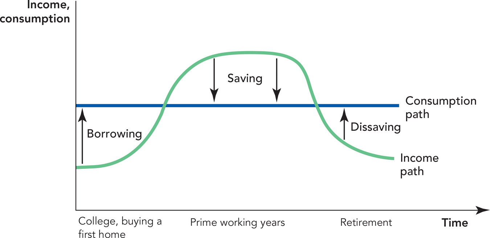
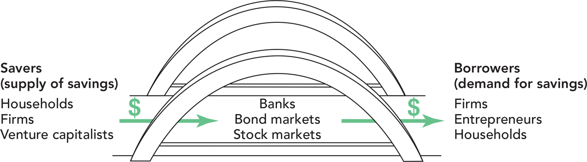

```{r setup, include=FALSE}
options(htmltools.dir.version = FALSE)
knitr::opts_chunk$set(echo = F,
                      warning = F,
                      message = F,
                      fig.retina = 3,
                      fig.align = "center")
library("tidyverse")
library("ggrepel")

theme_slides <- theme_light() + 
  theme(
    text = element_text(family = "Fira Sans", size = 24)
  )

```

class: inverse

# Outline

### [Labor Market for Competitive Firm](#12)

### [Labor Market for a Monopoly](#30)

### [Monopsony Power](#34)

### [Monopoly Power in Labor Markets: Unions](#54)

---

# What is Capital?

.pull-left[

- A note on how we used capital $K$ earlier this semester...

- Assumed capital (essentially machines) has a market price $“r”$, the “rental rate of capital”
  - Most firms purchase machines outright, rather than rent them per period (e.g. per hour)
  - But like any input, we consider the (opportunity) cost of using a marginal unit of an input as its market price if it were exchanged on the market
  - Hence, consider the price of capital the market rate to rent a machine for an hour

]

.pull-right[
.center[

]
]

---

# What is Capital?

.pull-left[

- Exact nature & definition remains controversial to economists to this day

- “Capital” is:
  - hard to define or (especially) aggregate
  - necessarily bound up with time and uncertainty

]

.pull-right[
.center[

]
]

---

# What Is Capital?

.pull-left[

.smallest[
- Economists (and others) often talk about different *types* of capital
  - .hi-turquoise[Physical capital]: tools, machines, specialized equipment, software, that makes labor more productive
  - .hi-turquoise[Human capital]: skills, training, education, experience embodied in a person that makes their labor more productive
  - .hi-turquoise[Financial capital]: access to immediate cash to finance investment for production

- Social scientists also talk about “political capital,” “social capital,” etc...
]
]

.pull-right[
.center[


]
]

---

# What Is Capital?

.pull-left[

.smallest[
- Some generally observed features of capital:

- .hi-turquoise[Capital is *not an original factor*]
  - It’s land & labor combined in the past (i.e. someone had to make the shovel, the factory, etc. with land & labor)

- .hi-turquoise[Capital goods are not directly consumed]
  - Used in the production of other goods

- .hi-turquoise[Capital inherently consists of a time element]
  - Makes labor more productive
  - Capital as “stored labor time”
  - Capital comes from **savings**, and earns **interest**

]
]
.pull-right[
.center[

]
]

---

# What Is Capital?

.pull-left[
.smallest[
- For our purposes today, let’s not think of capital as *physical* capital, but as financial capital
  - All types of capital have the following financial aspect

- Capital is about .hi-purple[the diversion of present consumption towards future consumption]
  - Capital comes from savings, and is used for investments that firms (and households) use to increase their (production for) consumption
  - The return that owners of capital get for providing capital to firms is .hi[interest]

]
]

.pull-right[
.center[

]
]

---

# What Is Capital?

.pull-left[

- Historically, the idea came from farmers

- During harvest time, can consume all produce today, or save some for next year
  - The more you save today, the less you can eat now, but the more you will have in the future
  - The more you consume today, the less you will have in the future

]

.pull-right[
.center[

]
]

---

# Capital Markets

.pull-left[

- Firms (and households) get money for investment today by participating in .hi[capital markets]

- The funds in capital markets come from individual savings
]

.pull-right[
.center[

]
]

---

class: inverse, center, middle

# The Time Value of Money

---

# Present vs. Future Goods

.pull-left[

- In discussing capital, we are comparing .hi-purple[present goods] with .hi-purple[future goods]

- Futures: claims on goods to be delivered at a future date
  - corn futures, oil futures, etc.

- Financial assets: bonds, lottery winnings, loans

- Real goods: immature orchard of fruit trees; durable goods that yield output later

]

.pull-right[
.center[

]
]

---

# Present vs. Future Goods

.pull-left[

- .hi-purple[Interest rate is a price of future goods in terms of present goods]
  - How much individuals will pay to receive income now vs. later

- .hi-purple[Investment in capital]: present consumption can be saved to buy/build machinery that can increase future income flows

]

.pull-right[
.center[

]
]

---

# Present vs. Future Goods

.pull-left[
- Consider goods-bundles consumed now vs. consumed at later date
  - i.e. not apples vs. oranges, but apples and oranges **today** vs. apples and oranges **next year**

- .hi-purple[Agent's objective]: optimize time-profile of consumption, **maximize net present value**

]

.pull-right[
.center[

]
]

---

# Present vs. Future Goods

.pull-left[

.smallest[
- .hi-purple[Time Value of Money]: same nominal amount of money<sup>.magenta[†]</sup> is worth different amounts over time

$$\begin{align*}
PV &= \frac{FV}{(1+r)^n}\\
FV &= PV(1+r)^n\\ \end{align*}$$

- $PV$: present value
- $FV$: future value
- $r$: interest rate
- $n$: number of time periods
]

.footnote[<sup>.magenta[†]</sup> Or income, or consumption...]
]

.pull-right[
.center[

]
]

---

# Present vs. Future Goods

.pull-left[

- .hi-green[Example]: what is the present value of getting $1,000 one year from now at 5% interest?

$$\begin{align*}
PV &= \frac{FV}{(1+r)^n}\\
PV &= \frac{1000}{(1+0.05)^1}\\
PV &= \frac{1000}{1.05}\\
PV &= \$952.38\\ 
\end{align*}$$

]

.pull-right[
```{r}
ggplot(data = tibble(x=1:10), aes(x=x))+
    annotate("segment", x = 1, xend = 0.08, y = 1000, yend = 952.38, colour = "purple", size=2, alpha=1, arrow=arrow(length=unit(0.5,"cm"), ends="last", type="closed"))+
  geom_label(x=0.04,y=952.38,label="V(0)", color = "purple")+
  geom_label(x=1,y=1000,label="V(1)", color = "purple")+
  scale_x_continuous(breaks=seq(0,1,1),
                     limits = c(0,1.5),
                     expand = c(0,0))+
  scale_y_continuous(breaks=seq(0,1200,50),
                     labels = scales::dollar,
                     limits=c(900,1200))+
  coord_cartesian(clip = "off")+
  labs(x = "Time",
       y = "Value",
       title = "Discounting the Future")+
  theme_classic(base_family = "Fira Sans Condensed", base_size =16)

```
]

---

# Present vs. Future Goods

.pull-left[

- .hi-green[Example]: what is the *future* value of $1,000 lent for one year at 5% interest?

$$\begin{align*}
FV &= PV(1+r)^n\\
FV &= 1000(1+0.05)^1\\
FV &= 1000(1.05)\\
FV &= \$1050\\
\end{align*}$$

]

.pull-right[
```{r}
ggplot(data = tibble(x=1:10), aes(x=x))+
    annotate("segment", x = 0, xend = 0.95, y = 1000, yend = 1050, colour = "purple", size=2, alpha=1, arrow=arrow(length=unit(0.5,"cm"), ends="last", type="closed"))+
  geom_label(x=0.04,y=1000,label="V(0)", color = "purple")+
  geom_label(x=1,y=1050,label="V(1)", color = "purple")+
  scale_x_continuous(breaks=seq(0,1,1),
                     limits = c(0,1.5),
                     expand = c(0,0))+
  scale_y_continuous(breaks=seq(0,1200,50),
                     labels = scales::dollar,
                     limits=c(900,1200))+
  coord_cartesian(clip = "off")+
  labs(x = "Time",
       y = "Value",
       title = "Earning Interest")+
  theme_classic(base_family = "Fira Sans Condensed", base_size =16)

```
]

---

# Rule of 72

.pull-left[

- A good rule of thumb: number of years for your principal to double:

$$\frac{72}{r}$$
- This is known as the .hi-purple[rule of 72]<sup>.magenta[1]</sup>

.footnote[<sup>.magenta[1]</sup> Different people use other numbers, like 70. The point is more to make mental calculations easily rather than accurately.]
]

.pull-right[
.center[

]
]

---

# Rule of 72

.hi-green[Example]:

- If interest rate is 2%, your money doubles in $\frac{72}{2}=36$ years

--

- If interest rate is 3%, your money doubles in $\frac{72}{3}=24$ years

--

- If interest rate is 4%, your money doubles in $\frac{72}{4}=18$ years

--

- If interest rate is 6%, your money doubles in $\frac{72}{6}=12$ years

--

- Interest rate is very important price! Makes all the difference whether it is 1% vs. 2%! 

---

# Compounding Interest

```{r, fig.width= 14}
two<-function(x){100*1.02^{x}}
three<-function(x){100*1.03^{x}}
four<-function(x){100*1.04^{x}}
six<-function(x){100*1.06^{x}}

# make plot 

ggplot(data.frame(x=c(0,10)), aes(x=x))+
  
  # curves 
  stat_function(fun=two, geom="line", size=2, color="red")+
  stat_function(fun=three, geom="line", size=2, color="orange")+
  stat_function(fun=four, geom="line", size=2, color="green")+
  stat_function(fun=six, geom="line", size=2, color="blue")+
  #geom_text(aes(x=q_PC,y=w,label="N.E.",family = "Yanone Kaffeesatz Regular"),hjust=-0.1, vjust=-0.25, color="black")+
  annotate(geom = "label", x = 42, y = two(42), label = "2%",
           color = "red", size = 4) +
  annotate(geom = "label", x = 42, y = three(42), label = "3%",
           color = "orange", size = 4) +
    annotate(geom = "label", x = 42, y = four(42), label = "4%",
           color = "green", size = 4) +
  annotate(geom = "label", x = 42, y = six(42), label = "6%",
           color = "blue", size = 4) +

  #annotate(geom = "label", x = 1.3, y = 5, label = "Consumer Surplus",
  #         color = "blue", size = 4.5) +
  scale_x_continuous(breaks = seq(0,50,5),
                     limits = c(0,50),
                     expand=c(0,0))+
  scale_y_continuous(breaks = seq(0,1400,100),
                     labels = function(x){paste0("$",x)},
                     limits = c(0,1400),
                     expand=c(0,0))+
  theme_classic(base_family = "Fira Sans Condensed", base_size=16)+
  labs(x = "Years",
       y = "Value")
```

---

# Historical Interest Rates

```{r, fig.width= 12}
library(fredr)
fredr_set_key("9100cdf3c862283007d8c83ce02059e6")

ffr<-fredr(
  series_id = "FEDFUNDS"
)

recessions <-fredr(
  series_id = "JHDUSRGDPBR"
)

recessions_start_end <- recessions %>% # from https://datavizm20.classes.andrewheiss.com/example/11-example/
  mutate(recession_change = value - lag(value)) %>% 
  filter(recession_change != 0)

recs <- tibble(start = filter(recessions_start_end, recession_change == 1)$date,
                     end = filter(recessions_start_end, recession_change == -1)$date)

ggplot(data = ffr)+
  aes(x = date,
      y = value,
      color = series_id)+
  geom_rect(data = recs, 
            aes(xmin = start, xmax = end, ymin = -Inf, ymax = Inf),
            inherit.aes = FALSE, fill = "black", alpha = 0.3)+
  geom_path(size=1)+
  geom_hline(yintercept=0, size=1)+
  scale_x_date(limits=as.Date(c("1955-01-01", "2021-01-01")),
               date_breaks = "5 years",
               #minor_breaks = "2 years",
               date_labels = "%Y",
               expand = c(0,0))+
  scale_y_continuous(breaks=seq(0,20,2),
               labels=function(x){paste0(x,"%")},
               limits = c(0,20),
               expand = c(0,0))+
  labs(x = "Year",
       y = "Federal Funds Rate",
       caption = "Data Source: FRED; Recessions Shaded in Gray")+
  theme_classic(base_family = "Fira Sans Condensed", base_size = 16)+
  theme(legend.position="none")
```

---

class: inverse, center, middle

# Individual Savings Decisions

---

# Individual Savings Decisions

.pull-left[

- The .red[Supply of Capital] comes from **individual decisions to save**

- Sacing is considered a .hi[disutility] (a .hi[bad])
  - **Opportunity cost** of saving is .hi[consumption]
  - But, saving (and lending) can earn .hi-purple[interest]

- Tradeoff: if you save more, you consume less today, but can consume more in the future (with interest income)
]

.pull-right[
.center[

]
]

---

# Individual Savings Decisions

.pull-left[

- Apply our consumer choice model to .hi[“intertemporal” choice] to consume:
$$u(c_1,c_2)$$
  - $c_1$: consumption today (period 1)
  - $c_2$: consumption tomorrow (period 2)

- Define amount of saving as:
$$s = M - c_1$$
  - where $M_0$ is today’s income
]

.pull-right[
.center[

]
]

---

# Individual Savings Decisions

.pull-left[
.smallest[
$$u(c_1,c_2)$$
- Individuals have a .hi[“time preference”] between present consumption and future consumption
  - In general, everyone prefers consumption today over consumption in the future
  - We place a .hi-purple[premium] on present consumption and .hi-purple[discount] future consumption
  - This is where the idea of .hi[interest] and the .hi-purple[time value of money] come from (more on those later)

- A measure of how .hi[impatient] you are
  - High time preference: strong preference for present consumption, not willing to wait to future
  - Low time preference: more willing to defer present consumption to future
]
]

.pull-right[
.center[

]
]

---

# Individual Savings Decisions

.pull-left[

- Most people follow a consistent “life cycle” of saving decisions

- People like to “smooth” their consumption over time, rather than experience sudden, discontinuous jumps in consumption level
  - When actual income $<$ preferred consumption: .hi[borrow] money
  - When actual income $>$ preferred consumption: .hi[save] (and .hi[lend]) money
]

.pull-right[
.center[

]
]

---

# Individual Savings Decisions

.pull-left[

$$u(c_1,c_2)$$

- .hi-purple[Marginal rate of (intertemporal) substitution]: rate at which person gives up future consumption $(c_1)$ to obtain more present consumption $(c_0)$
  - The slope of the indifference curve!

]
.pull-right[
```{r}
bc<-function(x){24-x}
ic<-function(x){144/x}
points<-tribble(
  ~x, ~y, ~letter,
  12, 12, "A"
)

ggplot(data = tibble(x = c(0,10)), aes(x = x))+
  #geom_segment(x = 12, xend = 12, y = 0, yend = 12, linetype = "dashed", size = 1)+
  #geom_segment(x = 0, xend = 12, y = 12, yend = 12, linetype = "dashed", size = 1)+
  #geom_function(fun = bc, geom = "line", size = 2, color = "red")+
  #geom_label(x = 2, y = bc(2), color = "red", label = "BC")+
  geom_function(fun = ic, geom = "line", size = 2, color = "blue")+
  geom_label(x = 22, y = ic(22), color = "blue", label = expression(u[1]))+
  #geom_point(data = subset(points, letter %in% c("A")), aes(x = x, y = y), size = 5)+
  scale_x_continuous(breaks = NULL,
                       #c(0,12, 24),
                     #labels = c(0, expression("\u2113"^"*"), expression(M[0])),
                     limits = c(0,25),
                     expand = c(0,0))+
  scale_y_continuous(breaks = NULL,
                     #c(0,12,24),
                     #labels = c(0,expression(c^"*"),"24w"),
                     expand = c(0,0),
                     limits = c(0,50))+
  labs(x = expression(paste("Present Consumption, ", c[0])),
       y = expression(paste("Future Consumption, ", c[1])))+
  theme_classic(base_family = "Fira Sans Condensed", base_size = 16)
```
]

---

# Individual Savings Decisions

.pull-left[
.smnallest[
- Suppose individual starts with an income today $M_0$
  - Must choose how much of it to consume today $(c_0)$ versus save to consume more in future $(c_1)$

- Let individual have opportunities to exchange in .hi[capital markets]
  - Exchange present goods $c_0$ for claims on future goods $c_1$ repaid with interest at  rate $r$
  - In extremes: can consume entirety of $M_0$ today, or save entirety of $M_0$ and earn interest to get $M_0(1+r)$ consumption next year
]
]
.pull-right[
```{r}

ggplot(data = tibble(x = c(0,10)), aes(x = x))+
  #geom_segment(x = 12, xend = 12, y = 0, yend = 12, linetype = "dashed", size = 1)+
  #geom_segment(x = 0, xend = 12, y = 12, yend = 12, linetype = "dashed", size = 1)+
   #geom_function(fun = ic, geom = "line", size = 2, color = "blue")+
  #geom_label(x = 22, y = ic(22), color = "blue", label = expression(u[1]))+

  geom_function(fun = bc, geom = "line", size = 2, color = "red")+
  geom_label(x = 2, y = bc(2), color = "red", label = "BC")+
  #geom_point(data = subset(points, letter %in% c("A")), aes(x = x, y = y), size = 5)+
  scale_x_continuous(breaks = c(0, 24),
                     labels = c(0, expression(M[0])),
                     limits = c(0,25),
                     expand = c(0,0))+
  scale_y_continuous(breaks = c(0,24),
                     labels = c(0,expression(M[0]*(1+r))),
                     expand = c(0,0),
                     limits = c(0,50))+
  labs(x = expression(paste("Present Consumption, ", c[0])),
       y = expression(paste("Future Consumption, ", c[1])))+
  theme_classic(base_family = "Fira Sans Condensed", base_size = 16)
```
]

---

# Individual Savings Decisions

.pull-left[

- .hi-purple[Opportunity cost] of consumption today $(c_0)$ is $1+r$
  - Forgo opportunity to save and invest to earn interest (and consume more) next period

- Let the price of future consumption be $1
  - Then the slope of .red[budget constraint] is
  
$$-\frac{p_{c_0}}{p_{c_1}}=-\frac{(1+r)}{1}=-(1+r)$$

]
.pull-right[
```{r}
ggplot(data = tibble(x = c(0,10)), aes(x = x))+
  #geom_segment(x = 12, xend = 12, y = 0, yend = 12, linetype = "dashed", size = 1)+
  #geom_segment(x = 0, xend = 12, y = 12, yend = 12, linetype = "dashed", size = 1)+
   #geom_function(fun = ic, geom = "line", size = 2, color = "blue")+
  #geom_label(x = 22, y = ic(22), color = "blue", label = expression(u[1]))+

  geom_function(fun = bc, geom = "line", size = 2, color = "red")+
  geom_label(x = 2, y = bc(2), color = "red", label = "BC")+
  #geom_point(data = subset(points, letter %in% c("A")), aes(x = x, y = y), size = 5)+
  scale_x_continuous(breaks = c(0, 24),
                     labels = c(0, expression(M[0])),
                     limits = c(0,25),
                     expand = c(0,0))+
  scale_y_continuous(breaks = c(0,24),
                     labels = c(0,expression(M[0]*(1+r))),
                     expand = c(0,0),
                     limits = c(0,50))+
  labs(x = expression(paste("Present Consumption, ", c[0])),
       y = expression(paste("Future Consumption, ", c[1])))+
  theme_classic(base_family = "Fira Sans Condensed", base_size = 16)
```
]

---

# Individual Savings Decisions

.pull-left[

- Consumer maximizes utility subject to budget constraint at $A$: $(c_0^\star, c_1^\star)$


]
.pull-right[
```{r}
opt<-ggplot(data = tibble(x = c(0,10)), aes(x = x))+
  geom_segment(x = 12, xend = 12, y = 0, yend = 12, linetype = "dashed", size = 1)+
  geom_segment(x = 0, xend = 12, y = 12, yend = 12, linetype = "dashed", size = 1)+
  geom_function(fun = ic, geom = "line", size = 2, color = "blue")+
  geom_label(x = 22, y = ic(22), color = "blue", label = expression(u[1]))+
  geom_function(fun = bc, geom = "line", size = 2, color = "red")+
  geom_label(x = 2, y = bc(2), color = "red", label = "BC")+
  geom_point(data = subset(points, letter %in% c("A")), aes(x = x, y = y), size = 5)+
  scale_x_continuous(breaks = c(0, 12, 24),
                     labels = c(0, expression(c[0]^"*"), expression(M[0])),
                     limits = c(0,25),
                     expand = c(0,0))+
  scale_y_continuous(breaks = c(0,12, 24),
                     labels = c(0,expression(c[1]^"*"), expression(M[0]*(1+r))),
                     expand = c(0,0),
                     limits = c(0,50))+
  labs(x = expression(paste("Present Consumption, ", c[0])),
       y = expression(paste("Future Consumption, ", c[1])))+
  theme_classic(base_family = "Fira Sans Condensed", base_size = 16)
opt
```
]

---

# Individual Savings Decisions

.pull-left[

- Consumer maximizes utility subject to budget constraint at $A$: $(c_0^\star, c_1^\star)$

- Consumes $c_0^\star$ today, saving $\color{#6A5ACD}{s = M_0 - c_0^\star}$ to consume $\color{#e64173}{c_1^\star = s(1+r)}$ next period

]
.pull-right[
```{r}
opt+
  annotate("segment", x = 24, xend = 12, y = 2, yend = 2, colour = "#6A5ACD", size=2, alpha=1, arrow=arrow(length=unit(0.5,"cm"), ends="both", type="closed"))+
  geom_label(x = 18, y = 2, label = expression(s == M[0]-c[0]^"*"), color = "#6A5ACD")+
    annotate("segment", x = 2, xend = 2, y = 0, yend = 12, colour = "#e64173", size=2, alpha=1, arrow=arrow(length=unit(0.5,"cm"), ends="both", type="closed"))+
  geom_label(x = 2, y = 6, label = expression(s(1+r)), color = "#e64173")
```
]

---

# Individual Savings Decisions: A Change in Interest Rate

.pull-left[
.smaller[
- What will happen to the optimal savings decision if **interest rate $r$ increases**?

- It depends!

- Consumption is a normal good, but this makes savings “inferior”
$$s = M_0 - c_0$$
  - $\uparrow c_0 \implies \downarrow s$

- Again, .hi-purple[income and substitution effects] are important!
]
]

.pull-right[
.center[

]
]

---

# Individual Savings Decisions: A Change in Interest Rate

.pull-left[

- .purple[(Overall) Price effect]: $A \rightarrow C$
  - Higher rate $r$ leads to less consumption today $c_0$ and therefore, more saving $s$

- Upward sloping .red[savings supply curve]
]

.pull-right[
```{r}
bc2<-function(x){48-2*x}
ic<-function(x){144/x}
points<-tribble(
  ~x, ~y, ~letter,
  12, 12, "A",
  8, 18, "B",
  10, 28, "C"
)

ic2<-function(x){400/(x+4)}


bc_sub<-function(x){34-2*x}


ggplot(data = tibble(x = c(0,10)), aes(x = x))+
  geom_segment(x = 10, xend = 10, y = 0, yend = 28, linetype = "dashed", size = 0.5)+
  geom_segment(x = 0, xend = 10, y = 28, yend = 28, linetype = "dashed", size = 0.5)+
  
  geom_segment(x = 12, xend = 12, y = 0, yend = 12, linetype = "dashed", size = 0.5)+
  geom_segment(x = 0, xend = 12, y = 12, yend = 12, linetype = "dashed", size = 0.5)+
  geom_function(fun = bc, geom = "line", size = 2, color = "red")+
  geom_label(x = 2, y = bc(2), color = "red", label = expression(BC[1]))+
  geom_function(fun = ic, geom = "line", size = 2, color = "blue")+
  geom_label(x = 22, y = ic(22), color = "blue", label = expression(u[1]))+
  
  geom_function(fun = bc2, geom = "line", size = 2, color = "darkred")+
  geom_label(x = 2, y = bc2(2), color = "darkred", label = expression(BC[2]))+
  
  # geom_function(fun = bc_sub, geom = "line", size = 2, color = "orange", linetype = "dashed")+
  
    geom_function(fun = ic2, geom = "line", size = 2, color = "green")+
  geom_label(x = 22, y = ic2(22), color = "green", label = expression(u[2]))+

  geom_point(data = subset(points, letter %in% c("A", "C")), aes(x = x, y = y), size = 5)+
  ggrepel::geom_text_repel(data = subset(points, letter %in% c("A", "C")), aes(x = x, y = y, label = letter), size = 4, seed = 4, box.padding = 0.5)+

  annotate("segment", x = 12, xend = 10, y = 2, yend = 2, colour = "purple", size=2, alpha=1, arrow=arrow(length=unit(0.5,"cm"), ends="last", type="closed"))+

  scale_x_continuous(breaks = c(0,10, 12, 24),
                     labels = c(0, expression(c[0]*minute), expression(c[0]), expression(M[0])),
                     limits = c(0,25),
                     expand = c(0,0))+
  scale_y_continuous(breaks = c(0,12,24,28,48),
                     labels = c(0,expression(c[1]),expression(M[0]*(1+r[1])),expression(c[1]*minute), expression(M[0]*(1+r[2]))),
                     expand = c(0,0),
                     limits = c(0,50))+
  labs(x = expression(paste("Present Consumption, ", c[0])),
       y = expression(paste("Future Consumption, ", c[1])))+
       #title = "Individual Labor Supply Decision: Increase in Wage",
       #subtitle = "(Substitution Effect Dominates)",)+
  theme_classic(base_family = "Fira Sans Condensed", base_size = 16)
```
]

---

# Individual Savings Decisions: A Change in Interest Rate

.pull-left[

- .orange[Substitution effect]: as interest rate $r$ increases, the price of present consumption $c_0$ is increasing, so consume less today
  - Thus, save more

- Graphically: under higher rate $BC_2$, substitute more $c_1$ for less $c_0$ (more saving) holding utility constant
  - $A \rightarrow B$: more $c_1$, less $c_1$ (more $s)$
]

.pull-right[
```{r}
bc_sub<-function(x){34-2*x}


se_dom<-ggplot(data = tibble(x = c(0,10)), aes(x = x))+
  geom_function(fun = bc, geom = "line", size = 2, color = "red")+
  geom_label(x = 2, y = bc(2), color = "red", label = expression(BC[1]))+
  geom_function(fun = ic, geom = "line", size = 2, color = "blue")+
  geom_label(x = 22, y = ic(22), color = "blue", label = expression(u[1]))+
  
  geom_function(fun = bc2, geom = "line", size = 2, color = "darkred")+
  geom_label(x = 2, y = bc2(2), color = "darkred", label = expression(BC[2]))+
  
  
  geom_function(fun = bc_sub, geom = "line", size = 2, color = "orange", linetype = "dashed")+
  
  geom_function(fun = ic2, geom = "line", size = 2, color = "green")+
  geom_label(x = 22, y = ic2(22), color = "green", label = expression(u[2]))+

  geom_segment(x = 10, xend = 10, y = 0, yend = 28, linetype = "dashed", size = 0.5)+
  geom_segment(x = 0, xend = 10, y = 28, yend = 28, linetype = "dashed", size = 0.5)+
  
  geom_segment(x = 12, xend = 12, y = 0, yend = 12, linetype = "dashed", size = 0.5)+
  geom_segment(x = 0, xend = 12, y = 12, yend = 12, linetype = "dashed", size = 0.5)+
  
  geom_segment(x = 8, xend = 8, y = 0, yend = 18, linetype = "dashed", size = 0.5)+
  geom_segment(x = 0, xend = 8, y = 18, yend = 18, linetype = "dashed", size = 0.5)+

  geom_point(data = subset(points, letter %in% c("A", "B", "C")), aes(x = x, y = y), size = 5)+
  ggrepel::geom_text_repel(data = subset(points, letter %in% c("A","B", "C")), aes(x = x, y = y, label = letter), size = 4, seed = 4, box.padding = 0.5)+

  #annotate("segment", x = 12, xend = 10, y = 2, yend = 2, colour = "purple", size=2, alpha=1, arrow=arrow(length=unit(0.5,"cm"), ends="last", type="closed"))+
  annotate("segment", x = 12, xend = 8, y = 5, yend = 5, colour = "orange", size=2, alpha=1, arrow=arrow(length=unit(0.5,"cm"), ends="last", type="closed"))+

  scale_x_continuous(breaks = c(0,8,10,12, 24),
                     labels = c(0, expression(c[0]^s), expression(c[0]*minute), expression(c[0]), expression(M[0])),
                     limits = c(0,25),
                     expand = c(0,0))+
  scale_y_continuous(breaks = c(0,12,18,24,28,48),
                     labels = c(0,expression(c[1]),expression(c[1]^s),expression(M[0]*(1+r[1])),expression(c[1]*minute), expression(M[0]*(1+r[2]))),
                     expand = c(0,0),
                     limits = c(0,50))+
  labs(x = expression(paste("Present Consumption, ", c[0])),
       y = expression(paste("Future Consumption, ", c[1])))+
       #title = "Individual Labor Supply Decision: Increase in Wage",
       #subtitle = "(Substitution Effect Dominates)",
  theme_classic(base_family = "Fira Sans Condensed", base_size = 16)
se_dom
```
]

---

# Individual Savings Decisions: A Change in Interest Rate

.pull-left[

- .green[Real income effect]: the higher interest rate makes you wealthier in real terms, so buy more of everything (including $c_0$, meaning **save less!**)
  - $B \rightarrow C$: attain higher indifference curve $\color{green}{u_2}$ 
  - “Inferior” good: higher interest rates induce *more* consumption today (and less saving)
]

.pull-right[
```{r}
se_dom+
  annotate("segment", x = 8, xend = 10, y = 8, yend = 8, colour = "green", size=2, alpha=1, arrow=arrow(length=unit(0.5,"cm"), ends="last", type="closed"))
```
]

---

# Individual Savings Decisions: A Change in Interest Rate

.pull-left[

- Income & substitution effects cut against each other

- If .orange[Substitution effect] $>$ .green[Income effect], then we get a positive .purple[price effect]:
  - **Increase in interest rate** causes .hi-purple[more saving] (less present consumption)

- Matches our intuition, .red[upward-sloping savings supply curve]
]

.pull-right[
```{r}
se_dom+
  annotate("segment", x = 8, xend = 10, y = 8, yend = 8, colour = "green", size=2, alpha=1, arrow=arrow(length=unit(0.5,"cm"), ends="last", type="closed"))+
  annotate("segment", x = 12, xend = 10, y = 2, yend = 2, colour = "purple", size=2, alpha=1, arrow=arrow(length=unit(0.5,"cm"), ends="last", type="closed"))+
  labs(x = expression(paste("Present Consumption, ", c[0])),
       y = expression(paste("Future Consumption, ", c[1])),
       title = "Increase in Interest Rate",
       subtitle = "(Substitution Effect Dominates)")
```
]

---

# Individual Savings Decisions: A Change in Interest Rate

.pull-left[

- If .green[Income effect] > .orange[Substitution effect], leading to a negative .purple[price effect]:
  - **Increase in interest rate** causes .hi-purple[less saving] (more present consumption)
  - “Giffen-style” scenario, but **plausible** for saving! (unlike consumer goods)

- Intuition: imagine having an savings target (for rainy day, or retirement), and interest rates increase
]

.pull-right[
```{r}
points2<-tribble(
  ~x, ~y, ~letter,
  12, 12, "A",
  8, 18, "B",
  14.5, 19, "C"
)

ic3<-function(x){300/(x-2)-4.5}

ggplot(data = tibble(x = c(0,10)), aes(x = x))+
  geom_function(fun = bc, geom = "line", size = 2, color = "red")+
  geom_label(x = 2, y = bc(2), color = "red", label = expression(BC[1]))+
  geom_function(fun = ic, geom = "line", size = 2, color = "blue")+
  geom_label(x = 22, y = ic(22), color = "blue", label = expression(u[1]))+
  
  geom_function(fun = bc2, geom = "line", size = 2, color = "darkred")+
  geom_label(x = 2, y = bc2(2), color = "darkred", label = expression(BC[2]))+
  
  geom_function(fun = bc_sub, geom = "line", size = 2, color = "orange", linetype = "dashed")+
  
    geom_function(fun = ic3, geom = "line", size = 2, color = "green")+
  geom_label(x = 22, y = ic3(22), color = "green", label = expression(u[2]))+

  geom_segment(x = 12, xend = 12, y = 0, yend = 12, linetype = "dashed", size = 0.5)+
  geom_segment(x = 0, xend = 12, y = 12, yend = 12, linetype = "dashed", size = 0.5)+
  
  geom_segment(x = 8, xend = 8, y = 0, yend = 18, linetype = "dashed", size = 0.5)+
  geom_segment(x = 0, xend = 8, y = 18, yend = 18, linetype = "dashed", size = 0.5)+

  geom_segment(x = 14.5, xend = 14.5, y = 0, yend = 19, linetype = "dashed", size = 0.5)+
  geom_segment(x = 0, xend = 14.5, y = 19, yend = 19, linetype = "dashed", size = 0.5)+

  geom_point(data = subset(points2, letter %in% c("A", "B", "C")), aes(x = x, y = y), size = 5)+
  ggrepel::geom_text_repel(data = subset(points2, letter %in% c("A","B", "C")), aes(x = x, y = y, label = letter), size = 4, seed = 4, box.padding = 0.5)+
  
  annotate("segment", x = 12, xend = 8, y = 5, yend = 5, colour = "orange", size=2, alpha=1, arrow=arrow(length=unit(0.5,"cm"), ends="last", type="closed"))+
  
  annotate("segment", x = 8, xend = 14.5, y = 8, yend = 8, colour = "green", size=2, alpha=1, arrow=arrow(length=unit(0.5,"cm"), ends="last", type="closed"))+
  annotate("segment", x = 12, xend = 14.5, y = 2, yend = 2, colour = "purple", size=2, alpha=1, arrow=arrow(length=unit(0.5,"cm"), ends="last", type="closed"))+

  scale_x_continuous(breaks = c(0, 8, 12, 14.5, 24),
                     labels = c(0, expression(c[0]^s), expression(c[0]), expression(c[0]*minute), expression(M[0])),
                     limits = c(0,25),
                     expand = c(0,0))+
  scale_y_continuous(breaks = c(0,12,18, 19, 24,48),
                     labels = c(0,expression(c[1]^s),expression(c[1]),expression(c[1]*minute), expression(M[0]*(1+r[1])), expression(M[0]*(1+r[2]))),
                     expand = c(0,0),
                     limits = c(0,50))+
  labs(x = expression(paste("Present Consumption, ", c[0])),
       y = expression(paste("Future Consumption, ", c[1])),
       title = "Increase in Interest Rate",
       subtitle = "(Income Effect Dominates)")+
  theme_classic(base_family = "Fira Sans Condensed", base_size = 16)
```
]

---

class: inverse, center, middle

# The Market For Loanable Funds

---

# The Market for Loanable Funds

.pull-left[

- In general, an upward sloping .red[market supply curve]

- Giving up money today in exchange for claim on future repayment with interest
  - Individuals that loan their savings are called .hi[capitalists] 🧐

- Individuals supply more (less) savings at higher (lower) interest rates

]

.pull-right[

```{r, fig.retina=3}
#library("mosaic")
Supply=function(x){x}

# make plot 

ggplot(data.frame(x=c(0,10)), aes(x=x))+
  
  # curves 
  stat_function(fun=Supply, geom="line", size=2, color="red")+
  # surpluses
  #geom_polygon(data=CS, aes(x=x,y=y, fill="Consumer"), alpha=0.5)+ #CS

  # labels 
  #geom_text(aes(x=q_PC,y=w,label="N.E.",family = "Yanone Kaffeesatz Regular"),hjust=-0.1, vjust=-0.25, color="black")+
  annotate(geom = "label", x = 2, y = Supply(2), label = "Supply (Savers)",
           color = "red", size = 6) +
  scale_x_continuous(breaks = c(0),
                     labels = c(0),
                     expand=c(0,0))+
  scale_y_continuous(breaks = c(0,10),
                     labels = c(0,expression(choke)),
                     limits = c(0,10),
                     expand=c(0,0))+
  theme_classic(base_family = "Fira Sans Condensed", base_size=16)+
  labs(x = "Quantity of Funds ($)",
       y = "Interest Rate (r)",
       title = "Market for Loanable Funds")
```

]

---
# Demand for Capital

.pull-left[

- As with labor, a .hi-blue[Firm's Demand for Capital]:

$$MRP_K=MP_K* MR(q)$$

- $MRP_K$: marginal revenue product of capital
- $MP_K$: marginal product of capital
- $MR(q)$: marginal revenue

- Firms borrow money today in exchange for promising future repayment with interest

- Firms borrow more (less) funds at lower (higher) interest rates
]

```{r, fig.retina=3}
#library("mosaic")
Demand=function(x){10-x}
MC=function(x){2}

# make plot 

ggplot(data.frame(x=c(0,10)), aes(x=x))+
  
  # curves 
  stat_function(fun=Demand, geom="line", size=2, color="blue")+
  # surpluses
  #geom_polygon(data=CS, aes(x=x,y=y, fill="Consumer"), alpha=0.5)+ #CS

  # labels 
  #geom_text(aes(x=q_PC,y=w,label="N.E.",family = "Yanone Kaffeesatz Regular"),hjust=-0.1, vjust=-0.25, color="black")+
  annotate(geom = "label", x = 6, y = Demand(6), label = expression("Firms' Demands"==MRP[K]),
           color = "blue", size = 6) +
  scale_x_continuous(breaks = c(0),
                     labels = c(0),
                     expand=c(0,0))+
  scale_y_continuous(breaks = c(0,10),
                     labels = c(0,expression(choke)),
                     limits = c(0,10),
                     expand=c(0,0))+
  theme_classic(base_family = "Fira Sans Condensed", base_size=16)+
  labs(x = "Quantity of Funds ($)",
       y = "Interest Rate (r)",
       title = "Loanable Funds Market")
```

---

# Demand for Capital

.pull-left[

- Note in general, firms are not the only borrowers of funds!

- Individuals borrow money to attain higher consumption than their current income
  - Mortgages, auto loans, student loans, etc.

- Governments also borrow money to attain higher spending levels than their current taxation

- .blue[Market Demand]+ Demand from Firms + Demand from Individuals + Demand from Government
]

```{r, fig.retina=3}
#library("mosaic")
Demand=function(x){10-x}
MC=function(x){2}

# make plot 

ggplot(data.frame(x=c(0,10)), aes(x=x))+
  
  # curves 
  stat_function(fun=Demand, geom="line", size=2, color="blue")+
  # surpluses
  #geom_polygon(data=CS, aes(x=x,y=y, fill="Consumer"), alpha=0.5)+ #CS

  # labels 
  #geom_text(aes(x=q_PC,y=w,label="N.E.",family = "Yanone Kaffeesatz Regular"),hjust=-0.1, vjust=-0.25, color="black")+
  annotate(geom = "label", x = 6, y = Demand(6), label = "Demand (Borrowers)",
           color = "blue", size = 6) +
  scale_x_continuous(breaks = c(0),
                     labels = c(0),
                     expand=c(0,0))+
  scale_y_continuous(breaks = c(0,10),
                     labels = c(0,expression(choke)),
                     limits = c(0,10),
                     expand=c(0,0))+
  theme_classic(base_family = "Fira Sans Condensed", base_size=16)+
  labs(x = "Quantity of Funds ($)",
       y = "Interest Rate (r)",
       title = "Loanable Funds Market")
```

---

# Individual Borrowing Decisions

.pull-left[

- Again, consider the “life cycle” of decisions

- People like to “smooth” their consumption over time, rather than experience sudden, discontinuous jumps in consumption level
  - When actual income $<$ preferred consumption: **borrow** money
  - When actual income $>$ preferred consumption: **save** (and lend) money
]

.pull-right[
.center[

]
]

---

# Market for Loanable Funds

.pull-left[

- Loanable funds market, where .red[savers] and .blue[borrowers] exchange present & future money

- Equilibrium market interest rate $r^\star$
]

```{r, fig.retina=3}
demand=function(x){10-x}
supply=function(x){x}

# make plot 

lf<-ggplot(data.frame(x=c(0,10)), aes(x=x))+
  
  # curves 
  stat_function(fun=demand, geom="line", size=2, color="blue")+
  stat_function(fun=supply, geom="line", size=2, color="red")+
  geom_segment(x=5,y=0,xend=5,yend=5,linetype=3, size = 1)+
  geom_segment(x=0,y=5,xend=5,yend=5,linetype=3, size = 1)+
  #geom_text(aes(x=q_PC,y=w,label="N.E.",family = "Yanone Kaffeesatz Regular"),hjust=-0.1, vjust=-0.25, color="black")+
  annotate(geom = "label", x = 8, y = demand(8), label = "Demand (borrowers)",
           color = "blue", size = 6) +
  annotate(geom = "label", x = 8, y = supply(8), label = "Supply (savings)",
           color = "red", size = 6) +
  #annotate(geom = "label", x = 1.3, y = 5, label = "Consumer Surplus",
  #         color = "blue", size = 4.5) +
  scale_x_continuous(breaks = c(5),
                     labels = c(expression(q^{"*"})),
                     expand=c(0,0))+
  scale_y_continuous(breaks = c(5),
                     labels = c(expression(r^{"*"})),
                     limits = c(0,10),
                     expand=c(0,0))+
  theme_classic(base_family = "Fira Sans Condensed", base_size=16)+
  labs(x = "Quantity of Funds ($)",
       y = "Interest Rate (i)",
       title = "Market for Loanable Funds")
lf
```

---

# Market for Loanable Funds

.pull-left[

- An increase in .blue[Demand] raises interest rate $r$ and quantity of funds loaned/borrowed
]

```{r, fig.retina=3}
demand_up=function(x){12-x}
# make plot 

ggplot(data.frame(x=c(0,10)), aes(x=x))+
  
  # curves 
  stat_function(fun=demand, geom="line", size=2, color="blue")+
  stat_function(fun=supply, geom="line", size=2, color="red")+
  geom_segment(x=5,y=0,xend=5,yend=5,linetype=3, size = 1)+
  geom_segment(x=0,y=5,xend=5,yend=5,linetype=3, size = 1)+
  
    geom_segment(x=6,y=0,xend=6,yend=6,linetype=3, size = 1)+
  geom_segment(x=0,y=6,xend=6,yend=6,linetype=3, size = 1)+

    stat_function(fun=demand_up, geom="line", size=2, color="darkblue")+
  annotate(geom = "label", x = 8, y = demand_up(8), label = "Demand 2",
           color = "darkblue", size = 6) +
  #geom_text(aes(x=q_PC,y=w,label="N.E.",family = "Yanone Kaffeesatz Regular"),hjust=-0.1, vjust=-0.25, color="black")+
  annotate(geom = "label", x = 8, y = demand(8), label = "Demand",
           color = "blue", size = 6) +
  annotate(geom = "label", x = 8, y = supply(8), label = "Supply",
           color = "red", size = 6) +
  #annotate(geom = "label", x = 1.3, y = 5, label = "Consumer Surplus",
  #         color = "blue", size = 4.5) +
  scale_x_continuous(breaks = c(5,6),
                     labels = c(expression(q[1]), expression(q[2])),
                     expand=c(0,0))+
  scale_y_continuous(breaks = c(5,6),
                     labels = c(expression(r[1]), expression(r[2])),
                     limits = c(0,10),
                     expand=c(0,0))+
  theme_classic(base_family = "Fira Sans Condensed", base_size=16)+
  labs(x = "Quantity of Funds ($)",
       y = "Interest Rate (i)",
       title = "Market for Loanable Funds")
```

---

# Market for Loanable Funds

.pull-left[

- An increase in .red[Supply] lowers interest rate $r$ and quantity of funds loaned/borrowed
]

```{r, fig.retina=3}
supply_up=function(x){x-2}
# make plot 

ggplot(data.frame(x=c(0,10)), aes(x=x))+
  
  # curves 
  stat_function(fun=demand, geom="line", size=2, color="blue")+
  stat_function(fun=supply, geom="line", size=2, color="red")+
  geom_segment(x=5,y=0,xend=5,yend=5,linetype=3, size = 1)+
  geom_segment(x=0,y=5,xend=5,yend=5,linetype=3, size = 1)+
  
    geom_segment(x=6,y=0,xend=6,yend=4,linetype=3, size = 1)+
  geom_segment(x=0,y=4,xend=6,yend=4,linetype=3, size = 1)+

    stat_function(fun=supply_up, geom="line", size=2, color="darkred")+
  annotate(geom = "label", x = 8, y = supply_up(8), label = "Supply 2",
           color = "darkred", size = 6) +
  #geom_text(aes(x=q_PC,y=w,label="N.E.",family = "Yanone Kaffeesatz Regular"),hjust=-0.1, vjust=-0.25, color="black")+
  annotate(geom = "label", x = 8, y = demand(8), label = "Demand",
           color = "blue", size = 6) +
  annotate(geom = "label", x = 8, y = supply(8), label = "Supply",
           color = "red", size = 6) +
  #annotate(geom = "label", x = 1.3, y = 5, label = "Consumer Surplus",
  #         color = "blue", size = 4.5) +
  scale_x_continuous(breaks = c(5,6),
                     labels = c(expression(q[1]), expression(q[2])),
                     expand=c(0,0))+
  scale_y_continuous(breaks = c(4,5),
                     labels = c(expression(r[2]), expression(r[1])),
                     limits = c(0,10),
                     expand=c(0,0))+
  theme_classic(base_family = "Fira Sans Condensed", base_size=16)+
  labs(x = "Quantity of Funds ($)",
       y = "Interest Rate (i)",
       title = "Market for Loanable Funds")
```

---

# Capital Markets

.pull-left[
.smallest[
- Several mechanisms and types of financial markets by which borrowers and lenders exchange present for future money

- .hi[Bond markets]: large companies (and governments) sell an I.O.U. to investors (“bondholders”), and will repay them with interest

- .hi[Equity markets]: large companies sells shares of stock to investors (“shareholders”), in exchange for ownership stake

- .hi[Banks]: savers deposit funds in bank (and are paid interest), and bank lends the deposits to borrowers (at higher interest rate)
]
]

.pull-right[
.center[



]
]